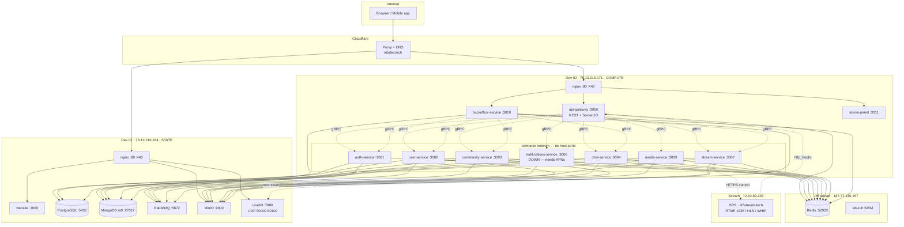
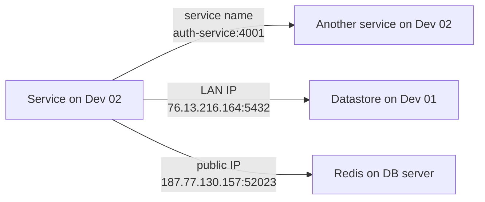
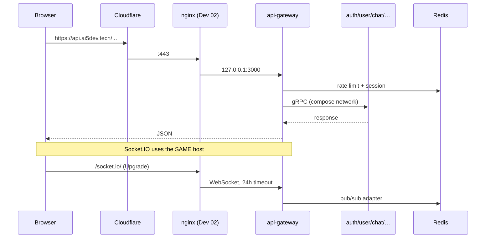
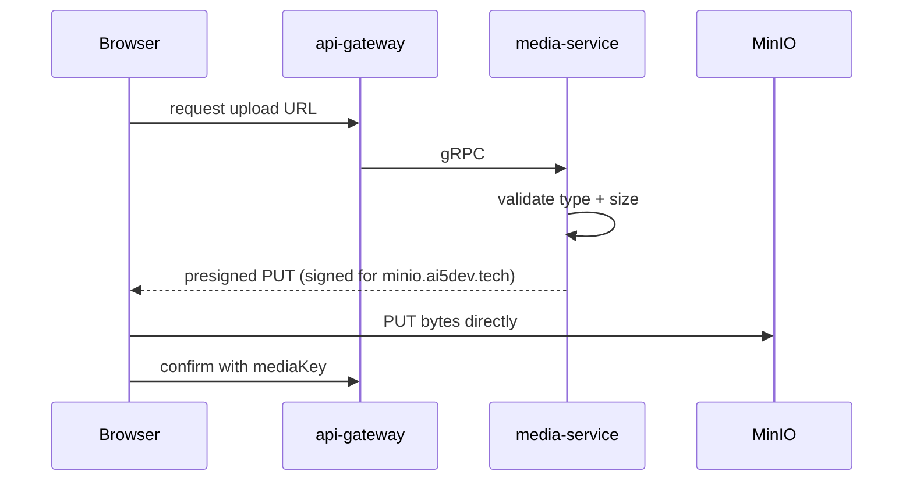
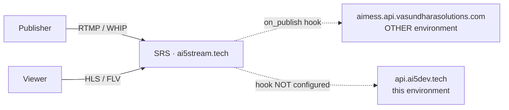
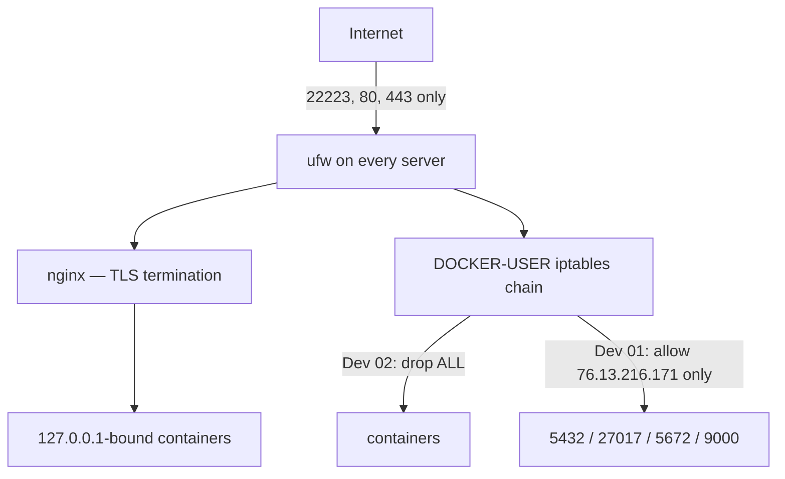

# AIMESS — Deployed Architecture

Verified live on **2026-08-07**. Every port, container and connection below was
read off the running servers, not copied from a plan.

---

## 1. The short version

Three servers, plus a fourth that was already running and was left alone.

| Server        | IP               | Role                                                               |
| ------------- | ---------------- | ------------------------------------------------------------------ |
| **Dev 01**    | `76.13.216.164`  | State: databases, queue, object storage, media SFU, public website |
| **Dev 02**    | `76.13.216.171`  | Compute: all 9 Node services + admin panel. Holds no data          |
| **DB / SIEM** | `187.77.130.157` | Redis (reused) + your pre-existing Wazuh install                   |
| **Stream**    | `72.62.69.126`   | SRS media server for `ai5stream.tech`. **Untouched**               |

The split is deliberate: **every gRPC call stays inside one Docker network on
Dev 02**. Only database, queue and storage traffic crosses between servers.

---

## 2. Whole-system view

---

## 3. What runs where, exactly

### Dev 01 — `76.13.216.164`

| Container                | Host binding                                     | Reachable from                 |
| ------------------------ | ------------------------------------------------ | ------------------------------ |
| `aimess-postgres`        | `76.13.216.164:5432`                             | Dev 02 only (DOCKER-USER rule) |
| `aimess-mongodb`         | `76.13.216.164:27017`                            | Dev 02 only                    |
| `aimess-rabbitmq`        | `76.13.216.164:5672`                             | Dev 02 only                    |
| `aimess-rabbitmq` (UI)   | `127.0.0.1:15672`                                | nginx only                     |
| `aimess-minio`           | `76.13.216.164:9000` + `127.0.0.1:9000`          | Dev 02 + nginx                 |
| `aimess-minio` (console) | `127.0.0.1:9001`                                 | nginx only                     |
| `aimess-livekit`         | host network — `7880`, `7881`, `50000-50100/udp` | Internet (media needs it)      |
| `aimess-website`         | `127.0.0.1:3000`                                 | nginx only                     |

### Dev 02 — `76.13.216.171`

| Container                      | HTTP | gRPC | Host binding        |
| ------------------------------ | ---- | ---- | ------------------- |
| `aimess-api-gateway`           | 3000 | —    | `127.0.0.1:3000`    |
| `aimess-auth-service`          | 3001 | 4001 | **none — internal** |
| `aimess-user-service`          | 3002 | 4002 | **none — internal** |
| `aimess-community-service`     | 3003 | 4003 | **none — internal** |
| `aimess-chat-service`          | 3004 | 4004 | `127.0.0.1:3004`    |
| `aimess-notifications-service` | 3006 | 4006 | **none — internal** |
| `aimess-stream-service`        | 3007 | 4007 | **none — internal** |
| `aimess-media-service`         | 3009 | 4009 | **none — internal** |
| `aimess-backoffice-service`    | 3010 | 4010 | `127.0.0.1:3010`    |
| `aimess-admin-panel`           | 3000 | —    | `127.0.0.1:3011`    |

**No container port on Dev 02 is exposed to the internet.** nginx is the only
way in. A DOCKER-USER rule drops all inbound container traffic on `eth0`, so a
port published carelessly in future stays closed by default.

---

## 4. How services find each other

Three different mechanisms, and mixing them up is the usual source of confusion:

| From → To                       | Address form                                  | Why                                         |
| ------------------------------- | --------------------------------------------- | ------------------------------------------- |
| Dev 02 service → Dev 02 service | **Docker service name** (`auth-service:4001`) | Same compose network. Never leaves the host |
| Dev 02 → Dev 01 datastore       | **LAN IP** (`76.13.216.164:5432`)             | Different host. Firewalled to Dev 02 only   |
| Anything → Redis                | `187.77.130.157:52023`                        | Firewalled to Dev01+Dev02 only              |
| stream-service → SRS            | `https://ai5stream.tech/api`                  | Remote, over public TLS                     |

> The `.env.example` files ship `AUTH_GRPC_URL=0.0.0.0:4001`. That is a **bind**
> address, not a dial target — connecting to `0.0.0.0` reaches nothing. The
> compose files override every one of these with a service name.

---

## 5. Data ownership

| Store      | Database                                                             | Owner                                                                |
| ---------- | -------------------------------------------------------------------- | -------------------------------------------------------------------- |
| PostgreSQL | `aimess_auth`                                                        | auth-service                                                         |
| PostgreSQL | `aimess_users`                                                       | user-service                                                         |
| PostgreSQL | `admin_db`                                                           | backoffice-service                                                   |
| PostgreSQL | `aimess_communities`, `aimess_moderation`                            | _created by the init script, unused — community data lives in Mongo_ |
| MongoDB    | `aimess_chat`                                                        | chat-service                                                         |
| MongoDB    | `community_db`                                                       | community-service                                                    |
| MongoDB    | `aimess_notifications`                                               | notifications-service                                                |
| MongoDB    | `stream_db`                                                          | stream-service                                                       |
| MongoDB    | `aimess_media`                                                       | media-service                                                        |
| Redis db0  | —                                                                    | shared: sessions, OTP, cache, Socket.IO adapter, Bull queue          |
| MinIO      | `aimess-avatars`, `aimess-chat`, `aimess-community`, `aimess-stream` | all private; access via presigned URLs only                          |

**MongoDB runs as a single-node replica set (`rs0`)** — not optional. Prisma's
Mongo connector wraps writes to `@unique`-indexed models in transactions, which
a standalone `mongod` cannot serve.

The replica set advertises itself as `localhost:27017`. That is deliberate:
mongod could not match the LAN IP to itself (Docker hairpin NAT), so it never
elected a primary. Every service connects with `directConnection=true` and so
never consults the advertised topology. **If you ever remove
`directConnection`, this breaks.**

---

## 6. Request flows

### Consumer API + realtime

Socket.IO is served **by api-gateway at `/socket.io/`** — namespaces live in
`apps/api-gateway/src/sockets/`. It is _not_ on chat-service.
`docker/nginx/nginx.conf` (local dev) proxies `/z-socket/` to chat-service:3004;
nothing serves that path and it 404s. Don't copy it.

### Media upload

Bytes never pass through the API. The presigned URL is signed against
`MINIO_PUBLIC_ENDPOINT`, so that value must exactly match the host the browser
uses or every signature is rejected.

### Livestream — resolved by polling, not hooks

SRS's `on_publish` hook still points only at the other environment, and a second
URL **cannot** be added: SRS rejects a publish if any hook returns non-zero, and
each environment denies the other's stream keys. Instead, `reconcileWithSrs()`
polls `GET /api/v1/streams/` every 30s and flips `PENDING → LIVE` for any stream
SRS is actually carrying. The stream server is untouched. See
`deploy/scripts/07-srs-add-hook.md`.

---

## 7. Security boundaries

**Docker publishes ports ahead of ufw in iptables.** `ufw deny 5432` does not
protect a container — ufw never sees the packet. That is why the databases are
protected by DOCKER-USER rules, reapplied every boot by
`aimess-docker-firewall.service`. Removing that unit silently exposes
PostgreSQL and MongoDB to the internet.

Verified from outside: only `22223`, `80`, `443` answer on any server.

---

## 8. Known gaps

| Gap                                                                             | Effect                                                                                        | Owner                                  |
| ------------------------------------------------------------------------------- | --------------------------------------------------------------------------------------------- | -------------------------------------- |
| **notifications-service down** — APNs provider built at import with blank creds | No push at all; RabbitMQ queues buffer durably until it starts                                | Needs APNs keys, or lazy-init approval |
| `minio.ai5dev.tech` still Cloudflare-**proxied**                                | Uploads at `CHAT_VIDEO_MAX_BYTES` (100 MB) hit Cloudflare's cap and 413 before reaching MinIO | Cloudflare toggle                      |
| `notification.ai5dev.tech` still **proxied**                                    | LiveKit calls connect but carry no audio/video — UDP cannot traverse the proxy                | Cloudflare toggle                      |
| SRS hooks point at the other environment                                        | Livestreams stay `PENDING`                                                                    | `07-srs-add-hook.md`                   |
| `APPLE_CLIENT_IDS` is a placeholder                                             | Apple Sign-In rejects tokens                                                                  | Apple Service ID needed                |
| Website social/Giphy/Maps keys blank                                            | Those buttons/features inert                                                                  | Needs keys + one website rebuild       |
| TURN disabled in LiveKit                                                        | Users behind UDP-blocking firewalls get no media                                              | Optional; needs cert on 5349           |
