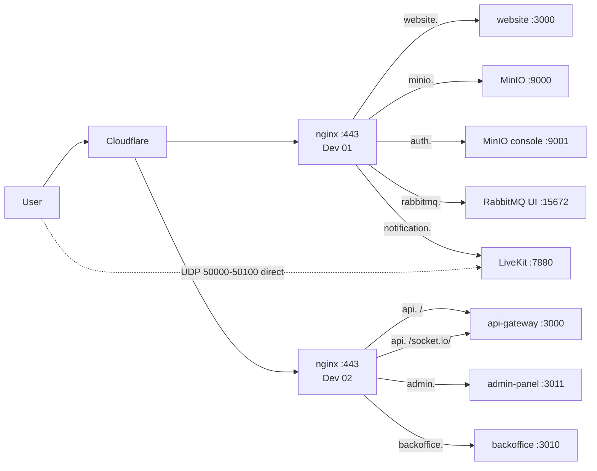

# AIMESS — Domains, Routing and Live Status

Every row below was probed on **2026-08-07**. Nothing here is assumed.

---

## 1. Straight answer: is everything running?

**No — 15 of 16 containers. One service is down and three things need you.**

Every public endpoint returns HTTP 200 and every service except one is healthy
with zero errors. But "all endpoints green" is not the same as "everything
works", so here is the honest split:

### Working and verified

| Area                                         | State                                                 |
| -------------------------------------------- | ----------------------------------------------------- |
| All 10 public endpoints                      | **200**                                               |
| 15 of 16 containers                          | running                                               |
| Error count, last 10 min, 8 backend services | **0**                                                 |
| MongoDB replica set                          | `myState=1` (PRIMARY)                                 |
| PostgreSQL                                   | 5 databases, 38 tables, 38 migrations applied         |
| MinIO                                        | 4 buckets, all private                                |
| RabbitMQ                                     | 21 queues declared                                    |
| Redis                                        | reachable from both app servers, AOF on, `noeviction` |
| Cross-server links from Dev 02               | Postgres, Mongo, RabbitMQ, MinIO, Redis — all OK      |
| TLS                                          | 8 certificates, auto-renew hooked                     |
| Firewall                                     | only 22223 / 80 / 443 answer from outside             |

### Not working

| Problem                                             | Impact                                                                                                                                                                       | Needs                                                |
| --------------------------------------------------- | ---------------------------------------------------------------------------------------------------------------------------------------------------------------------------- | ---------------------------------------------------- |
| **notifications-service is down** — restart-looping | **No push notifications at all.** RabbitMQ queues buffer durably, so nothing is lost; it drains when the service starts                                                      | APNs credentials, or approval to make APNs lazy-init |
| **`minio.ai5dev.tech` is Cloudflare-proxied**       | Uploads at the 100 MB video limit **will 413** before reaching MinIO, and the error appears in no application log                                                            | Grey-cloud the record                                |
| **`notification.ai5dev.tech` is proxied**           | **TURN (TLS 5349) is unreachable** — Cloudflare does not listen on that port. Calls fail _intermittently_: whoever's network blocks direct UDP has no fallback and times out | Grey-cloud the record                                |
| ~~SRS hooks point at the other environment~~        | **Fixed 2026-08-07.** Both hook-bearing SRS instances now authorise against ai5dev; RTMP + WHIP verified publishing                                                          | done — `deploy/scripts/07-srs-add-hook.md`           |
| `APPLE_CLIENT_IDS` is a placeholder                 | Apple Sign-In rejects tokens                                                                                                                                                 | Apple Service ID                                     |
| Website social/Giphy/Maps keys blank                | Those buttons and features inert                                                                                                                                             | Keys + one website rebuild                           |
| **No database backups**                             | Total loss if a disk fails                                                                                                                                                   | Scheduling — see OPERATIONS.md §13                   |

---

## 2. Domain map

| Domain                     | Origin server            | Container          | Port      | Cloudflare                 | Live      |
| -------------------------- | ------------------------ | ------------------ | --------- | -------------------------- | --------- |
| `api.ai5dev.tech`          | Dev 02 · `76.13.216.171` | api-gateway        | 3000      | proxied ✔                  | **200**   |
| `admin.ai5dev.tech`        | Dev 02 · `76.13.216.171` | admin-panel        | 3011      | proxied ✔                  | **200**   |
| `backoffice.ai5dev.tech`   | Dev 02 · `76.13.216.171` | backoffice-service | 3010      | proxied ✔                  | **200**   |
| `website.ai5dev.tech`      | Dev 01 · `76.13.216.164` | website            | 3000      | proxied ✔                  | **200**   |
| `minio.ai5dev.tech`        | Dev 01 · `76.13.216.164` | minio              | 9000      | **proxied ✘ must be grey** | **200**   |
| `notification.ai5dev.tech` | Dev 01 · `76.13.216.164` | livekit            | 7880      | **proxied ✘ must be grey** | **200**   |
| `auth.ai5dev.tech`         | Dev 01 · `76.13.216.164` | minio console      | 9001      | proxied ✔                  | **200**   |
| `rabbitmq.ai5dev.tech`     | Dev 01 · `76.13.216.164` | rabbitmq UI        | 15672     | proxied ✔                  | **200**   |
| `ai5stream.tech`           | Stream · `72.62.69.126`  | SRS                | 1935/8080 | DNS-only                   | **200**   |
| `community.ai5dev.tech`    | —                        | —                  | —         | —                          | **spare** |
| `backend.ai5dev.tech`      | —                        | —                  | —         | —                          | **spare** |

### Two subdomains do not do what their name says

- **`notification.ai5dev.tech` serves LiveKit**, not notification-service.
- **`auth.ai5dev.tech` serves the MinIO console**, not auth-service.

Both were spare: auth-service and notifications-service are internal-only and
sit behind `api.ai5dev.tech`. Giving auth-service a public route would let
callers bypass the gateway's sensitive-auth rate limiting. This is recorded in
the vhost files so nobody is misled later.

### The two Cloudflare toggles, precisely

Both currently resolve to `104.21.93.157 / 172.67.211.185` — proxied.

| Record                     | Set to                         | Because                                                                                                                                                                                                                                                                |
| -------------------------- | ------------------------------ | ---------------------------------------------------------------------------------------------------------------------------------------------------------------------------------------------------------------------------------------------------------------------- |
| `minio.ai5dev.tech`        | **DNS-only → `76.13.216.164`** | Cloudflare's free plan caps request bodies at 100 MB. `CHAT_VIDEO_MAX_BYTES` is exactly `104857600`. Proxied video uploads fail with a Cloudflare 413 that never reaches MinIO                                                                                         |
| `notification.ai5dev.tech` | **DNS-only → `76.13.216.164`** | LiveKit media is UDP 50000-50100 and TURN/TLS 5349, both direct to the host. Cloudflare carries neither, so the TURN relay is unreachable while proxied. Direct-UDP clients still connect — which is why calls fail only _sometimes_, and look exactly like an app bug |

Everything else can stay proxied.

---

## 3. Server and port reference

| Server    | IP               | SSH   | Public ports                                 |
| --------- | ---------------- | ----- | -------------------------------------------- |
| Dev 01    | `76.13.216.164`  | 22223 | 80, 443, 5349/tcp, 7881/tcp, 50000-50100/udp |
| Dev 02    | `76.13.216.171`  | 22223 | 80, 443                                      |
| DB / SIEM | `187.77.130.157` | 22223 | 80\*, 443 (Wazuh), 1514, 1515, 55000         |
| Stream    | `72.62.69.126`   | 22223 | 80, 443, 1935 (RTMP)                         |

Restricted, not public:

| Port            | Server    | Reachable only from              |
| --------------- | --------- | -------------------------------- |
| 5432 PostgreSQL | Dev 01    | `76.13.216.171`                  |
| 27017 MongoDB   | Dev 01    | `76.13.216.171`                  |
| 5672 RabbitMQ   | Dev 01    | `76.13.216.171`                  |
| 9000 MinIO      | Dev 01    | `76.13.216.171` + local nginx    |
| 52023 Redis     | DB server | `76.13.216.164`, `76.13.216.171` |

Verified from an external host: **only 22223, 80 and 443 answer anywhere.**
Every database port times out.

### Internal service ports (Dev 02, not reachable off-box)

| Service               | HTTP | gRPC | Datastore                      |
| --------------------- | ---- | ---- | ------------------------------ |
| api-gateway           | 3000 | —    | Redis                          |
| auth-service          | 3001 | 4001 | PostgreSQL `aimess_auth`       |
| user-service          | 3002 | 4002 | PostgreSQL `aimess_users`      |
| community-service     | 3003 | 4003 | MongoDB `community_db`         |
| chat-service          | 3004 | 4004 | MongoDB `aimess_chat`          |
| notifications-service | 3006 | 4006 | MongoDB `aimess_notifications` |
| stream-service        | 3007 | 4007 | MongoDB `stream_db`            |
| media-service         | 3009 | 4009 | MongoDB `aimess_media`         |
| backoffice-service    | 3010 | 4010 | PostgreSQL `admin_db`          |

---

## 4. Routing chain



Two direct paths bypass nginx entirely and must not be proxied:

- **LiveKit media** — UDP `50000-50100`, TCP `7881`, and TURN/TLS `5349` straight to `76.13.216.164`
- **RTMP ingest** — TCP `1935` straight to `72.62.69.126`

### Admin traffic

`admin.ai5dev.tech` calls `https://api.ai5dev.tech/admin/v1/...`, which the
gateway rewrites to backoffice-service. That path picks up `ADMIN_IP_WHITELIST`
and the admin rate limits.

`backoffice.ai5dev.tech` reaches the same service **directly, bypassing both**.
Consider IP-restricting or removing it — the vhost has a commented-out
`allow`/`deny` block ready.

Verified: `GET /admin/v1/auth/login` returns **401**, so the route and admin JWT
middleware are both live.

---

## 4b. Frontend API base URLs — the two apps differ

**These are not interchangeable. Copying one value to the other breaks it.**

| App             | `NEXT_PUBLIC_API_URL`            | Why                                         |
| --------------- | -------------------------------- | ------------------------------------------- |
| **website**     | `https://api.ai5dev.tech/api/v1` | Full consumer base, **including `/api/v1`** |
| **admin panel** | `https://api.ai5dev.tech`        | **Host root, no path**                      |

**website** — `src/configs/app.config.ts` derives the v2 base by replacing that
exact suffix:

```ts
const rawApiPrefix =
  process.env.NEXT_PUBLIC_API_URL || "https://api.aimess.app/api/v1";
const rawApiV2Prefix = rawApiPrefix.replace(/\/api\/v1(\/?)$/, "/api/v2$1");
```

Give it a bare host and the regex does not match, so `apiV2Prefix` silently
equals `apiPrefix` — **every v2 call goes to v1 and nothing reports an error**.
This was wrong at first deploy and is now corrected.

**admin panel** — `getAdminApiBaseUrl()` appends the prefix itself:

```ts
return `${host}/${adminPrefix}`; // host + /admin/v1
```

Putting `/api/v1` here would produce `/api/v1/admin/v1/...` and 404. The admin
surface is **not** under `/api/v1`; that prefix is consumer-only.

`NEXT_PUBLIC_SOCKET_URL` is the **host with no path** for both apps —
Socket.IO is served at `/socket.io/` and the client appends that itself.

Gateway mounts, for reference (`apps/api-gateway/src/app.ts`):

| Mount                              | Serves                           |
| ---------------------------------- | -------------------------------- |
| `/api/v1`, `/api/v2`               | consumer API                     |
| `/admin` → rewritten               | admin API (backoffice-service)   |
| `/socket.io/`                      | Socket.IO                        |
| `/health`, `/internal`, `/livekit` | ops, SRS hooks, LiveKit webhooks |

Verified live: `POST /api/v1/app-version/check` → **200**;
`GET /admin/v1/auth/login` → **401** (route + JWT middleware active). A `GET`
returning 404 on these paths is normal — most routes are POST-only.

---

## 5. Credentials and where they live

| Item                | Location                                                                        |
| ------------------- | ------------------------------------------------------------------------------- |
| SSH key             | your `~/.ssh/id_ed25519` — publickey only, port 22223                           |
| Sudo password       | `server_info.txt` — needed only for host-level changes                          |
| Generated secrets   | `/opt/aimess/shared-secrets.env` on Dev 01 **and** Dev 02 (mode 600, identical) |
| Backend runtime env | `/opt/aimess/aimess_backend/deploy/dev0{1,2}/.env.dev0{1,2}` (mode 600)         |
| Frontend build env  | `/opt/aimess/aimess_{website,admin_panel}/.env.production`                      |
| Bootstrap admin     | `harsh@vasundharasolutions.com` — password in `shared-secrets.env`              |

**Change the bootstrap admin password after first login**, then blank
`BOOTSTRAP_SUPER_ADMIN_PASSWORD`.

`firebase_cred.txt` and `server_info.txt` sit outside all three git repos, so
they cannot be committed by accident. They do hold a live service-account
private key and a Gmail app password in plaintext — move them to a password
manager and delete the local copies.

---

## 6. One-shot status check

```bash
for u in https://api.ai5dev.tech/health \
         https://backoffice.ai5dev.tech/health \
         "https://api.ai5dev.tech/socket.io/?EIO=4&transport=polling" \
         https://website.ai5dev.tech/ \
         https://admin.ai5dev.tech/ \
         https://minio.ai5dev.tech/minio/health/live \
         https://notification.ai5dev.tech/ ; do
  printf '%-58s %s\n' "$u" "$(curl -s -o /dev/null -w '%{http_code}' -m 15 "$u")"
done
```

All seven should print `200`. Then confirm nothing has crept onto the public
internet:

```bash
for p in 5432 27017 5672 9000; do nc -vz -w3 76.13.216.164 $p; done   # must time out
nc -vz -w3 187.77.130.157 52023                                        # must time out
```

---

## 7. What to do next, in order

1. **Decide on APNs** — send the four `APNS_*` values, or approve lazy-init so
   notifications-service starts and Android/web push work now.
2. **Grey-cloud `minio.` and `notification.`** — two clicks; without them large
   uploads and all call media are broken.
3. ~~Add the SRS second hook~~ — **done 2026-08-07.** Both hook-bearing SRS
   instances repointed; RTMP (OBS) and WHIP (camera) both verified publishing
   end to end. Consequence: the old environment can no longer publish to
   `ai5stream.tech`. Roll back **both** instances or neither —
   `deploy/scripts/07-srs-add-hook.md` §7.
4. **Send `APPLE_CLIENT_IDS`** and the website social/Giphy/Maps keys — one
   rebuild covers them all.
5. **Set up backups.** PostgreSQL, MongoDB and MinIO currently have none.
