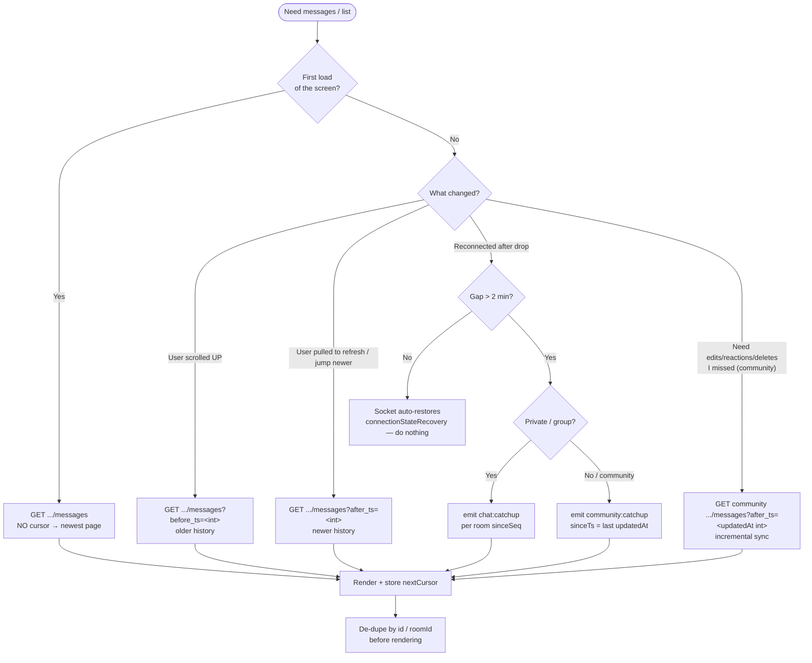
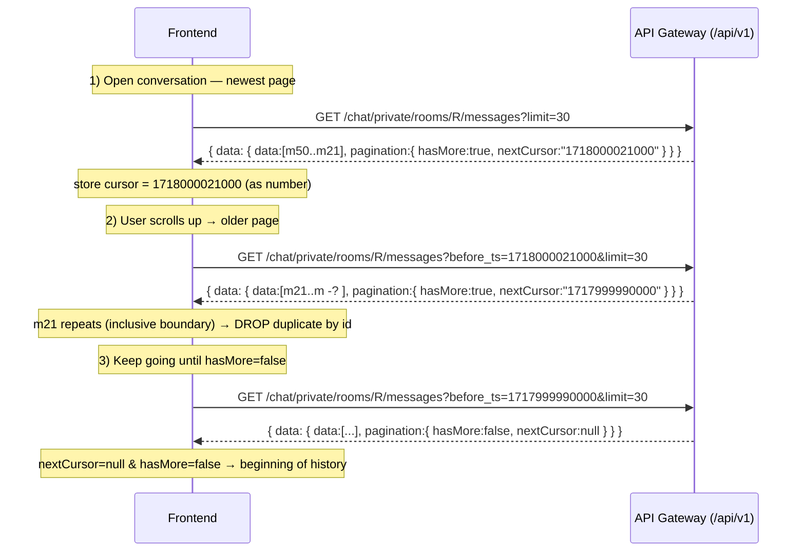
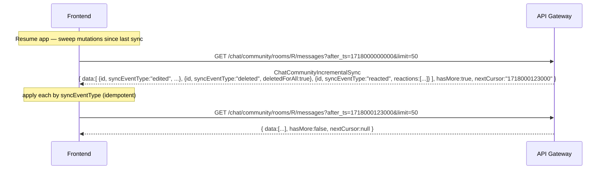
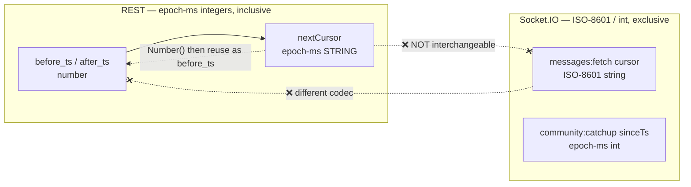

# Cursor Pagination — Frontend Guide

> How to page through messages, inbox, and community lists across **REST** and **Socket.IO**.
> This is the single source of truth for the `before_ts` / `after_ts` / `cursor` / `sinceTs` contract.
> Base URL for all REST paths below: **`/api/v1`**.

---

## TL;DR (read this first)

1. **Omit the cursor for the newest page.** Send `before_ts` to scroll **older**; `after_ts` to move **newer**.
2. **REST `nextCursor` is an epoch-ms STRING.** You **must** `Number()`-parse it before sending it back as `before_ts` / `after_ts` (which are integers).
3. **REST boundaries are inclusive → de-duplicate.** The boundary item can appear on two consecutive pages. De-dupe messages by `id`, inbox/communities by `roomId` / `id`.
4. **Socket boundaries are exclusive → no overlap.** The `cursor` item is **not** re-returned. Socket `cursor` is an **ISO-8601 string**, not epoch-ms — never feed a REST cursor into a socket call (or vice-versa).
5. **Two different "forward" meanings:**
   - `after_ts` on **private/group** = history forward-paging over `createdAt`.
   - `after_ts` on **community** = **incremental sync** over `updatedAt` (catches edits/reactions/deletes). Each item carries a `syncEventType`.
6. **Reconnect = run catch-up**, not normal paging. `chat:catchup` (per-room `sinceSeq`) for private/group; `community:catchup` (`sinceTs` for a full mutation sweep) for communities.

---

## 1. The cursor model at a glance

| Surface (REST `/api/v1/...`)                  | `before_ts` (scroll older)  | `after_ts` (move newer)       | Sort key                  | Boundary  | De-dupe by     | Response schema                                                             |
| --------------------------------------------- | --------------------------- | ----------------------------- | ------------------------- | --------- | -------------- | --------------------------------------------------------------------------- |
| `GET /chat/inbox`                             | `lastMessageAt <= ts`       | `lastMessageAt >= ts`         | `lastMessageAt`           | inclusive | `roomId`       | `ChatInboxPage`                                                             |
| `GET /chat/private/rooms/{roomId}/messages`   | `createdAt <= ts`           | `createdAt >= ts`             | `createdAt`               | inclusive | message `id`   | `ChatMessagePage`                                                           |
| `GET /chat/groups/{roomId}/messages`          | `createdAt <= ts`           | `createdAt >= ts`             | `createdAt`               | inclusive | message `id`   | `ChatMessagePage`                                                           |
| `GET /chat/community/rooms/{roomId}/messages` | `createdAt <= ts` (history) | **`updatedAt >= ts` (sync!)** | `createdAt` / `updatedAt` | inclusive | message `id`   | `ChatCommunityMessagePage` (scroll) / `ChatCommunityIncrementalSync` (sync) |
| `GET /communities/mine`                       | `lastActivityAt <= ts`      | `lastActivityAt >= ts`        | `lastActivityAt`          | inclusive | community `id` | `MyCommunitiesResponseData`                                                 |

> ⚠️ `before_ts` and `after_ts` are **mutually exclusive** — send at most one. Sending both → `400`.

### Socket counterparts

| Socket event (namespace)                  | Cursor field               | Format                       | Boundary  | Direction                  |
| ----------------------------------------- | -------------------------- | ---------------------------- | --------- | -------------------------- |
| `messages:fetch` (`/chat`)                | `cursor`                   | **ISO-8601 string**          | exclusive | backward only (older)      |
| `community:messages:fetch` (`/community`) | `cursor`                   | **ISO-8601 string**          | exclusive | backward only (older)      |
| `chat:catchup` (`/chat`)                  | `sinceSeq` (per room)      | integer (sequenceNumber)     | exclusive | forward (gap-fill)         |
| `community:catchup` (`/community`)        | `sinceId` **or** `sinceTs` | ObjectId **or** epoch-ms int | exclusive | forward (gap-fill / sweep) |

---

## 2. Which call do I make? (decision flow)



---

## 3. Core flow — open a chat & scroll up (REST)

The everyday case: load newest messages, then page backward as the user scrolls up.



**Rules that make this correct**

- `nextCursor` comes back as `"1718000021000"` (string). Do `const cursor = Number(res.data.pagination.nextCursor)` before the next request.
- Because the boundary is **inclusive**, the last item of page _N_ is also the first item of page _N+1_. Maintain a `Set<messageId>` and drop already-seen ids.
- Stop when `hasMore === false` (equivalently `nextCursor === null`).

---

## 4. Community incremental sync (`after_ts` = updatedAt)

Community history scroll uses `before_ts` (over `createdAt`). But to reconcile **edits, reactions, and deletions** you missed, use **`after_ts`**, which the server runs over **`updatedAt`** and returns a different envelope with a `syncEventType` on every item.



**`syncEventType` → what FE does**

| `syncEventType` | Meaning                          | FE action (idempotent)              |
| --------------- | -------------------------------- | ----------------------------------- |
| `new`           | A message you hadn't seen        | Insert (skip if id already present) |
| `edited`        | Body changed                     | Replace text/content for that id    |
| `reacted`       | Reaction set changed             | Replace `reactions` for that id     |
| `deleted`       | Tombstone (`deletedForAll:true`) | Remove / show "deleted" for that id |

> The sync envelope (`ChatCommunityIncrementalSync`) has **no `pagination` wrapper** — just `{ data, hasMore, nextCursor }`. The scroll envelope (`ChatCommunityMessagePage`) **does** have `pagination`. Branch your response parsing on which param you sent (`before_ts` → scroll, `after_ts` → sync).

---

## 5. Reconnect / catch-up (Socket.IO)

Normal paging is for the user scrolling. **Catch-up is for filling a gap after a disconnect.** Socket.IO restores up to 2 minutes automatically; beyond that, re-join rooms and run catch-up.

```mermaid
sequenceDiagram
    participant FE as Frontend
    participant GW as Gateway (Socket.IO)

    Note over FE,GW: Connection dropped > 2 min, then reconnected
    alt Private / group rooms
        FE->>GW: emit chat:catchup { rooms:[{ roomId, sinceSeq:142, conversationType:"private", limit:100 }] }
        GW-->>FE: ack + missed messages (sequenceNumber > 142)
        Note over FE: store new max sequenceNumber as next sinceSeq
    else Community rooms (full mutation sweep)
        FE->>GW: emit community:catchup { rooms:[{ roomId, sinceTs:1718000000000, limit:100 }] }
        GW-->>FE: community:catchup:result per room<br/>{ events:[{syncEventType,...}], hasMore, nextTs:1718000123000, lastId }
        Note over FE: store nextTs as next sinceTs; apply events by syncEventType
    end
```

**`community:catchup` — two modes, pick one per room**

| Mode      | Cursor                       | Returns                                        | Forward cursor | Use when                                                 |
| --------- | ---------------------------- | ---------------------------------------------- | -------------- | -------------------------------------------------------- |
| `sinceId` | last message ObjectId        | **new + deleted only** (insertion order)       | `lastId`       | quick gap-fill, you don't care about edits               |
| `sinceTs` | epoch-ms of last `updatedAt` | **all mutations** (new/edited/reacted/deleted) | **`nextTs`**   | returning from background — you need full reconciliation |

> ⚠️ **`sinceId` silently misses edits and reactions.** If you need those, use `sinceTs`.
> ⚠️ In `sinceTs` mode you **must** store `nextTs` and pass it as the next `sinceTs` — `lastId` cannot drive forward paging there. (`sinceId` and `sinceTs` are mutually exclusive per room; `sinceTs` wins if both are sent.)

---

## 6. Cross-transport cursor mapping (do NOT mix codecs)



| Operation                    | REST                                                      | Socket.IO                                                |
| ---------------------------- | --------------------------------------------------------- | -------------------------------------------------------- |
| Newest page                  | `GET .../messages` (no cursor)                            | `messages:fetch` (no cursor)                             |
| Page backward (history)      | `?before_ts=<epoch-ms>` (inclusive, `createdAt`)          | `messages:fetch { cursor }` (ISO-8601, exclusive)        |
| Page forward (history)       | `?after_ts=<epoch-ms>` (inclusive, `createdAt`)           | — (use catch-up)                                         |
| Incremental sync (mutations) | community `?after_ts=<epoch-ms>` (inclusive, `updatedAt`) | `community:catchup { sinceTs }` (exclusive, `updatedAt`) |
| Jump to message              | `?around=<id>`                                            | —                                                        |

---

## 7. Response shapes (TypeScript)

Every REST response is wrapped in the standard envelope. `data` holds the page.

```ts
// Standard envelope
interface ApiResponse<T> {
  success: true;
  message: string;
  data: T;
}

// Pagination metadata (shared by offset + cursor endpoints)
interface PaginationMeta {
  totalData: number; // best-effort count in cursor mode — do not page on it
  totalPage: number; // best-effort in cursor mode
  currentPage: number; // always 1 in cursor mode
  limit: number;
  nextCursor: string | null; // epoch-ms STRING in cursor mode; null when hasMore=false
  hasMore: boolean; // cursor mode: (returned === limit) — USE THIS to keep paging
}

// Private / group messages  &  inbox  (GET .../messages, GET /chat/inbox)
interface ChatMessagePage {
  // and ChatInboxPage (items = inbox rows)
  pagination: PaginationMeta;
  data: ChatMessage[];
  hasMore: boolean; // shortcut === pagination.hasMore
  nextCursor: string | null; // shortcut === pagination.nextCursor
}

// Community SCROLL mode  (before_ts)
interface ChatCommunityMessagePage {
  pagination: PaginationMeta;
  data: ChatCommunityMessage[];
  hasMore: boolean;
  nextCursor: string | null; // epoch-ms string of last createdAt
}

// Community SYNC mode  (after_ts) — NO pagination wrapper
interface ChatCommunityIncrementalSync {
  data: Array<
    ChatCommunityMessage & {
      syncEventType: "new" | "edited" | "deleted" | "reacted";
    }
  >;
  hasMore: boolean;
  nextCursor: string | null; // epoch-ms string of last updatedAt
}
```

---

## 8. Reference snippet — generic backward pager (REST)

```ts
async function loadOlder(
  roomId: string,
  state: { cursor: number | null; seen: Set<string>; done: boolean }
) {
  if (state.done) return [];

  const qs = new URLSearchParams({ limit: "30" });
  if (state.cursor != null) qs.set("before_ts", String(state.cursor)); // integer

  const res = await api.get<ApiResponse<ChatMessagePage>>(
    `/api/v1/chat/private/rooms/${roomId}/messages?${qs}`
  );
  const { data: items, pagination } = res.data.data;

  // inclusive boundary → drop duplicates
  const fresh = items.filter((m) => !state.seen.has(m.id));
  fresh.forEach((m) => state.seen.add(m.id));

  // nextCursor is a STRING → parse before reuse
  state.cursor =
    pagination.nextCursor != null ? Number(pagination.nextCursor) : null;
  state.done = !pagination.hasMore;

  return fresh;
}
```

---

## 9. Gotchas checklist

- [ ] Parse `nextCursor` with `Number()` before sending it as `before_ts` / `after_ts`.
- [ ] De-dupe REST pages (inclusive boundary): messages by `id`, inbox/communities by `roomId`/`id`.
- [ ] Use `hasMore` (not `currentPage`/`totalPage`) to decide whether to keep paging in cursor mode.
- [ ] Never send `before_ts` **and** `after_ts` together (→ 400).
- [ ] Community `after_ts` is **sync over `updatedAt`** (different envelope, `syncEventType`) — not plain forward paging.
- [ ] Don't feed a REST epoch-ms cursor into a socket `cursor` (socket wants ISO-8601) or vice-versa.
- [ ] On `community:catchup`, prefer `sinceTs` if you need edits/reactions; persist `nextTs` for the next sweep.
- [ ] Treat every sync/catch-up apply as **idempotent** (re-applying a delete/edit/reaction is a no-op).

---

_Backend contract sources: OpenAPI at `apps/api-gateway/src/docs/openapi/`, AsyncAPI at `apps/api-gateway/asyncapi/asyncapi.yaml`. Mermaid blocks render on GitHub and most markdown viewers._
