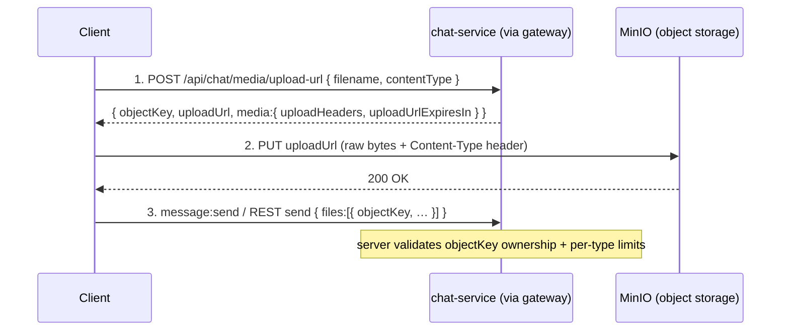

# AIMess — Media Upload Protocol

How clients attach media (images, video, audio/voice, documents, GIFs) to chat,
group, and community messages. **File bytes never travel over the Socket.IO
connection or through the gateway as a message payload** — they go straight to
object storage (MinIO / S3-compatible) via a short-lived **presigned URL**, and
the message then carries only the resulting `objectKey`.

> Source of truth: `apps/media-service/src/api/controllers/media.controller.ts`,
> `apps/media-service/src/config/uploads.ts`, and `@aimess/storage`. If code and
> this doc disagree, code wins — update this doc in the same PR.

---

## 1. The three-step flow



1. **Sign** — ask the backend for a presigned upload URL.
2. **PUT** — upload the bytes **directly** to storage at that URL.
3. **Reference** — send the message (socket `message:send` /
   `community:message:send`, or the REST send endpoints) with the returned
   `objectKey` inside `files[]`. The server never receives the bytes; it stores
   only the key.

The same `objectKey` later resolves to a time-limited **download/view URL**
(step in §4) for rendering.

---

## 2. Step 1 — request a presigned upload URL

**Endpoint** (chat attachments): `POST /api/chat/media/upload-url`
(authenticated; rate-limited **30 requests / minute / user**).

Request:

```jsonc
{
  "filename": "vacation.jpg", // ≤ 255 chars
  "contentType": "image/jpeg", // MUST be one of the allowed MIME types (§3)
}
```

Response (`200`):

```jsonc
{
  "success": true,
  "data": {
    "objectKey": "chat-uploads/<userId>/<uuid>.jpg", // server-generated, owner-scoped
    "uploadUrl": "https://minio…/chat-uploads/…?X-Amz-Signature=…",
    "contentType": "image/jpeg",
    "media": {
      "fileId": "<uuid>",
      "objectKey": "chat-uploads/<userId>/<uuid>.jpg",
      "fileName": "vacation.jpg",
      "contentType": "image/jpeg",
      "uploadUrl": "https://minio…",
      "uploadUrlExpiresIn": 300, // seconds (MINIO_PRESIGN_EXPIRES_IN)
      "uploadHeaders": { "Content-Type": "image/jpeg" },
      "downloadUrl": "https://minio…/chat-uploads/…?X-Amz-Signature=…", // ready-to-render presigned GET
      "downloadUrlExpiresIn": 3600, // seconds (MINIO_VIEW_EXPIRES_IN)
    },
  },
}
```

- `objectKey` is **server-generated** and scoped to the authenticated user
  (`chat-uploads/<userId>/<uuid>.<ext>`). Clients never choose the key — this is
  what lets the send path verify the file belongs to the sender.
- The upload URL is valid for `uploadUrlExpiresIn` seconds (default **5 minutes**).
  Re-request if it expires before the PUT completes.
- `media.downloadUrl` is a **ready-to-render** presigned GET for the just-minted
  object — use it for an instant preview right after the PUT (it resolves once the
  bytes land). It is presigned and expires (`downloadUrlExpiresIn`, ~1h): treat it
  as **display-only, never persist it**. The durable thing you store/send is the
  `objectKey` — the server re-signs a fresh URL on every read (§5).

> **Other resources use their owning service** (same pattern, different route &
> bucket): user **avatars** → user-service `POST /api/v1/users/upload/url`;
> community avatars/covers → community-service upload route. Chat/group/community
> **message attachments** all use the chat-service `media/upload-url` above.

---

## 3. Step 2 — PUT the bytes to storage

`PUT` the raw file to `uploadUrl`, echoing the headers from `media.uploadHeaders`
(at minimum `Content-Type` must match the signed `contentType`):

```
PUT <uploadUrl>
Content-Type: image/jpeg

<raw bytes>
```

**Allowed MIME types** (chat attachments — the request is rejected otherwise):

| Kind     | MIME types                                                                     |
| -------- | ------------------------------------------------------------------------------ |
| Image    | `image/jpeg` · `image/png` · `image/webp` · `image/gif`                        |
| Video    | `video/mp4` · `video/quicktime`                                                |
| Audio    | `audio/mpeg` · `audio/ogg` · `audio/wav`                                       |
| Document | `application/pdf` · `application/msword` · `…wordprocessingml.document` (docx) |

**Size limits** are enforced when the message is **sent** (per-type, in the
send validators / service guard — e.g. image vs. video vs. document caps from
`CHAT_*_MAX_BYTES`), not at presign time. A PUT that exceeds the eventual
per-type cap will be accepted by storage but the **send will be rejected** — so
check size client-side before uploading.

**Failure handling:**

- PUT fails / times out → retry the PUT against the same `uploadUrl` while it is
  still valid; if expired, re-request a new URL (step 1) and PUT again.
- The upload is **not** tied to any message yet — an orphaned object (uploaded but
  never referenced) is harmless and may be reaped by a storage lifecycle policy.
- Never send a `message:send` until the PUT has returned `200`.

---

## 4. Step 3 — reference the object in a message

Send the message with the `objectKey` inside `files[]` (socket
`message:send` / `community:message:send`, or the REST send endpoints). Include
the client-derived display metadata so peers can render before downloading:

```jsonc
{
  "conversationId": "…",
  "clientMessageId": "…", // UUID idempotency key
  "contentType": "IMAGE", // UPPER-CASE (see SOCKET_EVENTS.md)
  "files": [
    {
      "objectKey": "chat-uploads/<userId>/<uuid>.jpg",
      "name": "vacation.jpg",
      "mime": "image/jpeg",
      "size": 204800,
      "width": 1080,
      "height": 720,
      "blurhash": "LEHV6nWB2yk8pyo0adR*.7kCMdnj", // image/video instant preview
      "durationMs": 0, // audio/video length
      "waveform": [], // voice-note amplitude bars
    },
  ],
}
```

- A **single** file is `files: [ … ]` of length one. Galleries send up to **30**
  entries. (The deprecated `mediaKey` shorthand still folds into `files[]`.)
- Either `objectKey` **or** an external `url` (e.g. a Tenor GIF) is accepted per
  entry. External GIFs/stickers use `url` and skip the upload flow entirely.

### Thumbnails, blurhash & waveform — client responsibility

The backend does **not** transcode, generate thumbnails, or compute previews.
The **client** computes and supplies:

- `blurhash` — a compact blur preview for images/video (renders the bubble at the
  right aspect ratio instantly, before download).
- `width` / `height` — for layout without download.
- `waveform` — amplitude samples for voice notes (paint the bars pre-download).
- `durationMs` — audio/video length.

These ride in `files[]` and are echoed back on `message:new` so every recipient
renders the same instant preview.

---

## 5. Downloading / rendering

**You usually do not need a separate call.** Every read path resolves media for
you, server-side: chat / group / community **history**, the **`message:new` /
`message:edited`** socket pushes, conversation & inbox **lists**, **reactions**,
**pins**, and all **avatars / covers** come back with a fully-qualified, presigned
`url` / `senderAvatar` / `downloadUrl` — **never a raw object key**. Render those
directly. Because presigned URLs expire (~1h), the server re-signs a fresh one on
**every** read — so never persist a resolved URL; keep the `objectKey` (or just
re-fetch the list/message) and use whatever URL the latest read returned.

The standalone endpoint below is a **fallback** for the rare case where you hold a
bare `objectKey` with no surrounding response:

`POST /api/chat/media/download-url` (authenticated; **120 requests / minute /
user**):

```jsonc
// request
{ "objectKey": "chat-uploads/<userId>/<uuid>.jpg" }   // ≤ 500 chars

// response
{ "success": true, "data": { "objectKey": "…", "downloadUrl": "https://minio…", "media": { … } } }
```

The `downloadUrl` is a time-limited presigned GET (default `MINIO_VIEW_EXPIRES_IN`).
Re-request when it expires; do not cache it past its lifetime. Cache the **bytes**
locally keyed by `objectKey`, not the signed URL.

---

## 6. Cancelling an upload

If the user aborts the flow before (or after) the PUT completes, delete the orphaned object so storage does not accumulate stale files.

```http
DELETE /api/v1/media/uploads/:objectKey?category=CHAT_ATTACHMENT
Authorization: Bearer <accessToken>
```

`objectKey` must be **URL-encoded** if it contains slashes
(e.g. `chat-uploads%2F<userId>%2F<uuid>.jpg`).

Rules:

- The caller must own the object (`objectKey` must be prefixed with the authenticated user's ID under the category's key prefix). Returns `403 MEDIA_CANCEL_FORBIDDEN` otherwise.
- Returns `200` on success and also when the object no longer exists (safe to call multiple times).
- Rate-limited at the same cap as upload-url requests.
- Category must match the one used when the presigned URL was requested.

---

## 7. Rules of thumb

- **Never** put file bytes in a socket frame, a message field, or the database —
  only the `objectKey`.
- Upload **before** send; send only after a `200` PUT.
- One stable `clientMessageId` per logical message — re-sending after a flaky
  network is idempotent (it won't double-post the attachment).
- Validate MIME + size **client-side**; the server re-validates and will reject a
  send that violates the per-type cap or an `objectKey` the user doesn't own.
- Treat presigned URLs as secrets with a short TTL — don't log or share them.
