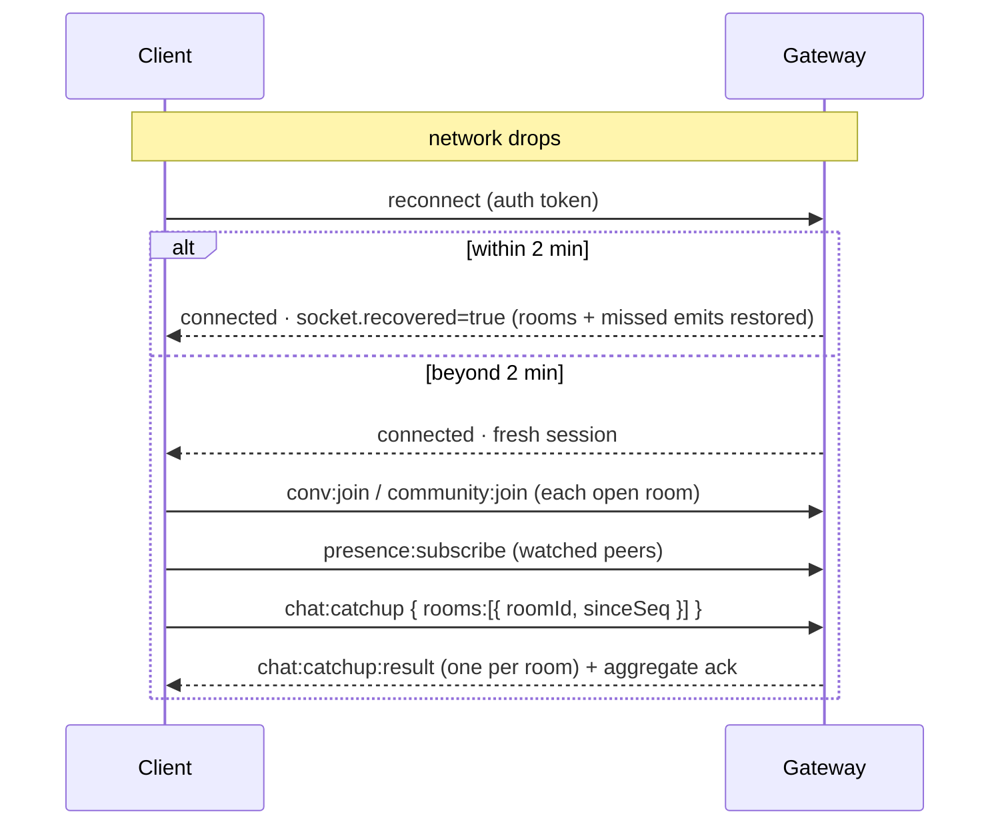
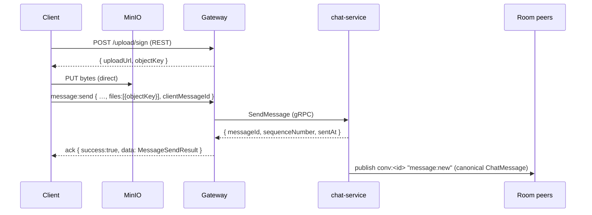
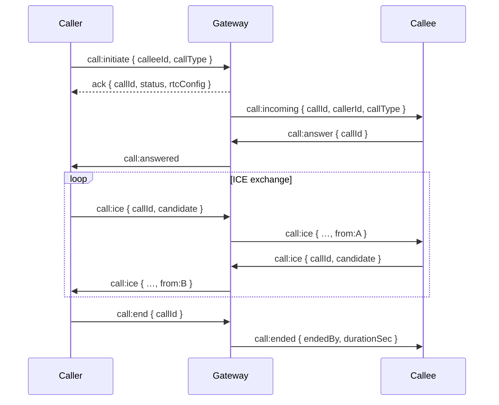

# AIMess — Socket.IO Event Reference

Real-time contract between mobile/web clients and the backend. All Socket.IO
traffic terminates at the **api-gateway**; the gateway validates payloads,
calls the owning microservice over gRPC, and fans events back out via the
**Redis adapter**. Backend services never hold sockets — they `publish` to a
Redis channel and the gateway re-emits to the matching room.

> Source of truth: `apps/api-gateway/src/sockets/`. If code and this doc
> disagree, code wins — then update this file in the same PR.
>
> **Machine-readable spec:** an AsyncAPI 3.0 description of every event lives at
> `apps/api-gateway/asyncapi/asyncapi.yaml` (validate/preview/generate via
> `pnpm --filter @aimess/api-gateway asyncapi:validate|asyncapi:preview|asyncapi:docs`).
> Keep it in sync with this doc.

---

## 1. Connection

| Property       | Value                                                                                  |
| -------------- | -------------------------------------------------------------------------------------- |
| Transport path | `/socket.io/`                                                                          |
| Base URL       | gateway origin (e.g. `https://api.aimess…` / `http://localhost:8000`)                  |
| Namespaces     | `/chat`, `/community`, `/notify`, `/stream`                                            |
| Max payload    | `1 MB` (`maxHttpBufferSize`)                                                           |
| State recovery | `connectionStateRecovery` — up to **2 min** disconnection window                       |
| Heartbeat      | Socket.IO defaults — `pingInterval` **25 s** / `pingTimeout` **20 s** (not overridden) |
| Compression    | `perMessageDeflate: false`                                                             |
| CORS           | allow-list from `CORS_ALLOWED_ORIGINS`, `credentials: true`                            |

> Heartbeat uses Socket.IO defaults (`pingInterval` 25 s / `pingTimeout` 20 s) — we
> deliberately did NOT adopt the more aggressive 10–15 s a mobile checklist
> suggested: the 2-min `connectionStateRecovery` window already covers
> dead-connection recovery, and tighter pings increase radio wakeups / battery
> drain. `maxHttpBufferSize` is 1 MB (a JSON-envelope backstop; media never
> crosses the socket — see §8.10).

### Authentication (required on every namespace)

JWT **access token** is read on the handshake, in this order:

1. `socket.handshake.auth.token` ← preferred
2. `Authorization: Bearer <token>` header

No anonymous sockets. A missing/invalid/expired token rejects the connection
with `Error("Authentication required")` or `Error("Authentication failed")`.
On success the socket carries `{ userId, sessionId }` derived from the token —
clients never send their own `userId`.

```js
import { io } from "socket.io-client";

const chat = io(`${BASE_URL}/chat`, {
  path: "/socket.io/",
  transports: ["websocket"],
  auth: { token: accessToken },
  query: { platform: "ios", clientType: "mobile" }, // optional, used for presence
});
```

**Client configuration.** Use the **Socket.IO v4** client. Set
`transports: ["websocket", "polling"]` (WS-first, with a polling fallback for
restrictive networks). The three namespaces (`/chat`, `/community`, `/notify`)
share **one** multiplexed connection — open them on the same `BASE_URL` and the
client reuses the underlying transport. Reconnection uses Socket.IO's default
exponential backoff (see §8.1).

### Handshake query (optional, `/chat` only)

| Field                                    | Purpose                              | Default     |
| ---------------------------------------- | ------------------------------------ | ----------- |
| `platform` (or header `x-platform`)      | device platform recorded in presence | `"unknown"` |
| `clientType` (or header `x-client-type`) | client kind recorded in presence     | `"unknown"` |

On `/chat` connect the gateway also calls presence `connect` with
`appState: "FOREGROUND"` (best-effort).

---

## 2. Rooms (server-computed — never sent by the client)

| Room                      | Joined when                               | Used for                                         |
| ------------------------- | ----------------------------------------- | ------------------------------------------------ |
| `user:<userId>`           | automatically on connect (all namespaces) | per-user fan-out: calls, presence, notifications |
| `conv:<conversationId>`   | client emits `conv:join`                  | 1-1 **and** group message events                 |
| `community:<communityId>` | client emits `community:join`             | community chat events                            |
| `call:<callId>`           | implicit via `call:*` Redis pattern       | WebRTC signaling                                 |

`presence:subscribe` lets a client also join other users' `user:<peerId>` rooms
to receive their `presence:status` updates.

---

## 3. Conventions

### Acknowledgements

Most **request/response** events take an ack callback. Every namespace
(`/chat`, `/community`, `/notify`) answers with the **same** envelope:

```jsonc
// success
{ "success": true, "message": "Message sent successfully", "data": { /* gRPC result */ } }

// success, no data (e.g. conv:join)
{ "success": true, "message": "Joined the conversation successfully" }

// failure
{ "success": false, "error": "<CODE>", "retryable": <bool>, "message": "The request data is invalid" }
```

**`message`** is **always present** (success _and_ failure): a localized,
display-ready sentence the client can show as-is. It is resolved from the shared
`t()` catalog (`@aimess/constants` → `SOCKET_MESSAGES`) using the socket's
`x-lang` / `Accept-Language` at handshake time (defaults: English in dev,
Vietnamese in prod). Branch your logic on `success` / `error` / `retryable` —
never on the `message` string. Per-event success copy is listed in §3.1.

`error` is one of a fixed, branchable set; `retryable` tells the client whether
re-emitting the **same** payload may succeed later:

| `error`           | Meaning                                                              | `retryable` | Client action                                                               |
| ----------------- | -------------------------------------------------------------------- | ----------- | --------------------------------------------------------------------------- |
| `INVALID_PAYLOAD` | Zod validation failed at the gateway                                 | `false`     | fix the payload; do not retry as-is                                         |
| `SERVICE_ERROR`   | downstream gRPC / service error                                      | `true`      | retry with exponential backoff                                              |
| `RATE_LIMITED`    | a server rate limit tripped                                          | `true`      | back off until `retryAfter` epoch-ms if present, else 30 s; then retry once |
| `FORBIDDEN`       | authenticated but not allowed (not a member/blocked/role)            | `false`     | surface to user; do not retry                                               |
| `NOT_FOUND`       | target message / conversation / community missing                    | `false`     | surface to user; do not retry                                               |
| `CONFLICT`        | conflicts with current state (already applied / edit window expired) | `false`     | reconcile state; do not blind-retry                                         |

> Today the gateway emits `INVALID_PAYLOAD` (bad payload) and `SERVICE_ERROR`
> (downstream failure) directly; `FORBIDDEN` / `NOT_FOUND` / `RATE_LIMITED` /
> `CONFLICT` are reserved in the contract so service-layer errors can be mapped
> to them without a breaking change — clients should branch on all six now.

#### 3.1 Success acknowledgement messages

Every acked event returns a localized confirmation in `message`. English copy
below (Vietnamese resolved by the same key — see `SOCKET_MESSAGES` in
`@aimess/constants`):

| Namespace    | Event                      | `message` (en)                                  |
| ------------ | -------------------------- | ----------------------------------------------- |
| `/chat`      | `conv:join`                | Joined the conversation successfully            |
| `/chat`      | `conv:leave`               | Left the conversation successfully              |
| `/chat`      | `message:send`             | Message sent successfully                       |
| `/chat`      | `message:read`             | Messages marked as read                         |
| `/chat`      | `message:react`            | Reaction added successfully                     |
| `/chat`      | `messages:fetch`           | Messages fetched successfully                   |
| `/chat`      | `chat:catchup`             | Caught up successfully                          |
| `/chat`      | `message:edit`             | Message edited successfully                     |
| `/chat`      | `message:delivered`        | Messages marked as delivered                    |
| `/chat`      | `message:forward`          | Message forwarded successfully                  |
| `/chat`      | `message:reactions:get`    | Reactions fetched successfully                  |
| `/chat`      | `presence:subscribe`       | Subscribed to presence updates                  |
| `/chat`      | `presence:unsubscribe`     | Unsubscribed from presence updates              |
| `/chat`      | `presence:unsubscribe_all` | Unsubscribed from all presence updates          |
| `/chat`      | `presence:list`            | Presence subscription list fetched successfully |
| `/chat`      | `call:initiate`            | Call initiated successfully                     |
| `/chat`      | `call:answer`              | Call answered successfully                      |
| `/chat`      | `call:decline`             | Call declined                                   |
| `/chat`      | `call:end`                 | Call ended                                      |
| `/community` | `community:join`           | Joined the community successfully               |
| `/community` | `community:leave`          | Left the community successfully                 |
| `/community` | `community:message:send`   | Message sent successfully                       |
| `/community` | `community:messages:fetch` | Community messages fetched successfully         |
| `/community` | `community:message:react`  | Reaction added successfully                     |
| `/community` | `community:catchup`        | Caught up successfully                          |
| `/community` | `community:message:edit`   | Message edited successfully                     |
| `/community` | `community:message:delete` | Message deleted successfully                    |
| `/community` | `community:message:pin`    | Message pinned successfully                     |
| `/community` | `community:message:unpin`  | Message unpinned successfully                   |
| `/notify`    | `notifications:fetch`      | Notifications fetched successfully              |
| `/notify`    | `notifications:mark_read`  | Notifications marked as read                    |
| `/notify`    | `notifications:delete`     | Notification deleted                            |

Failure acks carry a one-sentence localized `message` per error code (e.g.
`INVALID_PAYLOAD` → "The request data is invalid", `SERVICE_ERROR` →
"Something went wrong, please try again", `FORBIDDEN` → "You are not allowed to
perform this action").

Events marked **fire-and-forget** below have **no ack** — invalid payloads are
silently dropped (`safeParse` fails → `return`), so validate client-side. The
high-frequency signaling events `typing:start`, `typing:stop`,
`presence:heartbeat`, and `call:ice` are intentionally fire-and-forget (clients
emit them continuously and never await a reply), so they return **no** `message`.

> **Numeric fields in ack `data`:** values backed by gRPC `int64` (`sentAt`,
> `editedAt`, `pinnedAt`, `sequenceNumber`) are plain epoch-ms / integer
> **numbers** on the **ack** — the gateway coerces the gRPC `longs:String`
> wire-strings before relaying, so they match the **server→client broadcast**
> (e.g. `community:message:new`). Any existing `Number(sentAt)` coercion on the
> client stays harmless.

```js
chat.emit("message:send", payload, (res) => {
  if (res.success) {
    /* res.data */
  } else {
    /* res.error */
  }
});
```

### `conversationType`

Where present, accepts `"private"` | `"group"` (case-insensitive, defaults to
`"private"`). It selects the private vs. group code path in chat-service.

---

## 4. `/chat` namespace

Owns 1-1 messages, group messages, read/delivery receipts, reactions, typing,
presence, and 1-1 WebRTC call signaling. Delegates to **chat-service** over gRPC.

### 4.1 Client → Server

| Event                      | Ack | Payload                                                                                                            | Notes                                                                                                                         |
| -------------------------- | --- | ------------------------------------------------------------------------------------------------------------------ | ----------------------------------------------------------------------------------------------------------------------------- |
| `conv:join`                | yes | `{ conversationId }`                                                                                               | joins `conv:<id>` — **idempotent** (re-joining is always `success:true`; NOT_FOUND/FORBIDDEN enforced at `message:send` time) |
| `conv:leave`               | yes | `{ conversationId }`                                                                                               | leaves `conv:<id>` — **idempotent** (leaving a non-joined room is `success:true`)                                             |
| `message:send`             | yes | see below                                                                                                          | create a message                                                                                                              |
| `message:read`             | yes | `{ conversationId, upToMessageId }`                                                                                | mark read up to a message                                                                                                     |
| `message:delivered`        | yes | `{ conversationId, upToMessageId }`                                                                                | delivered receipt (client emits on receiving `message:new`); private only                                                     |
| `message:react`            | yes | `{ messageId, conversationId, emoji }`                                                                             | toggle/add reaction                                                                                                           |
| `message:reactions:get`    | yes | `{ messageId, conversationId, conversationType? }`                                                                 | list who reacted                                                                                                              |
| `message:edit`             | yes | `{ messageId, conversationId, contentText?, contentJson?, conversationType? }`                                     | edit own message                                                                                                              |
| `message:forward`          | yes | `{ messageId, targetConversationId, clientMessageId, conversationType?, receiverId?, senderName?, senderAvatar? }` | forward into another conversation                                                                                             |
| `messages:fetch`           | yes | `{ conversationId, cursor?, limit?≤100, conversationType? }`                                                       | cursor-paged history                                                                                                          |
| `chat:catchup`             | yes | `{ rooms: [{ roomId, sinceSeq?≥0, conversationType?, limit?≤200 }]≤50 }`                                           | reconnect gap-fill by per-room `sequenceNumber` (see below)                                                                   |
| `typing:start`             | no  | `{ conversationId }`                                                                                               | broadcast to `conv:<id>`                                                                                                      |
| `typing:stop`              | no  | `{ conversationId }`                                                                                               | broadcast to `conv:<id>`                                                                                                      |
| `presence:heartbeat`       | no  | `{ appState? }`                                                                                                    | keep presence alive; `appState` default `"FOREGROUND"`                                                                        |
| `presence:subscribe`       | yes | `{ peerIds: string[]≤500 }`                                                                                        | watch peers' presence                                                                                                         |
| `presence:unsubscribe`     | yes | `{ peerIds: string[]≤500 }`                                                                                        | stop watching specific peers                                                                                                  |
| `presence:unsubscribe_all` | yes | `{}`                                                                                                               | clear **all** peer subscriptions at once; ack `data.unsubscribedCount`                                                        |
| `presence:list`            | yes | `{}`                                                                                                               | list currently-watched peerIds; ack `data.peerIds: string[]`                                                                  |
| `call:initiate`            | yes | `{ calleeId, callType?: "AUDIO"\|"VIDEO", privateRoomId? }`                                                        | start a call                                                                                                                  |
| `call:answer`              | yes | `{ callId }`                                                                                                       | accept                                                                                                                        |
| `call:decline`             | yes | `{ callId }`                                                                                                       | reject a ringing call                                                                                                         |
| `call:end`                 | yes | `{ callId }`                                                                                                       | hang up (caller or callee)                                                                                                    |
| `call:ice`                 | no  | `{ callId, candidate }`                                                                                            | relay ICE candidate (Redis-only, not persisted)                                                                               |

**`message:send` payload**

```jsonc
{
  "conversationId": "string", // required, ≤200
  "clientMessageId": "string", // required — client idempotency key (UUID), ≤200
  "contentType": "TEXT", // required — UPPER-CASE: TEXT|IMAGE|VIDEO|AUDIO|VOICE|DOCUMENT|GIF|STICKER|LOCATION|CONTACT|SYSTEM
  "contentText": "hello", // optional, ≤4000
  "mediaKey": "string", // DEPRECATED — use files[]; folded into files[] if set
  "files": [
    // optional — attachments, ≤30 (a single file is an array of one)
    {
      "objectKey": "…", // ≤500 — from the media-upload flow (docs/MEDIA_UPLOAD.md)
      "url": "…", // ≤3000 — OR an external URL (e.g. a Tenor GIF)
      "name": "",
      "size": 0,
      "mime": "",
      "width": 0,
      "height": 0,
      "durationMs": 0,
    },
  ],
  "urls": ["https://…"], // optional — link previews, ≤20
  "location": { "lat": 0, "lng": 0, "placeName": "…", "placeAddress": "…" },
  "contact": { "name": "…", "phone": "…", "avatar": "…", "userId": "…" },
  "repliedToId": "string", // optional — reply target
  "conversationType": "private", // private|group
  "receiverId": "string", // optional — peer (private)
  "senderName": "string", // optional — denormalized for fan-out, ≤120
  "senderAvatar": "string", // optional, ≤3000
}
```

> Either `objectKey` **or** `url` is expected on a file entry. **File bytes never
> cross the socket** — upload first and send the `objectKey` (see
> [`docs/MEDIA_UPLOAD.md`](MEDIA_UPLOAD.md)). `mediaKey` is **deprecated**: if set
> and no file carries an `objectKey`, the gateway folds it into `files[]` — new
> clients should send `files[]` only. The gateway packs
> `contentText`/`urls`/`files`/`location`/`contact` into `contentJson` before the
> gRPC call. Ack `data` is the `MessageSendResult` shape
> (`{ messageId, conversationId, sequenceNumber, sentAt, alreadySent }`).
>
> **Stickers are community-only in V1** — there is no `sticker` field on a 1-1 or
> group `message:send`. Send a `STICKER`-typed reference via `files[]`, or use a
> community (which has a dedicated `sticker` attachment).

### 4.2 Server → Client

Published by chat-service to a Redis channel; the gateway re-emits to the room.

> **Timestamps:** every datetime emitted on a socket event (e.g. typing `timestamp`, `conv:archived.archivedAt`, `pinnedAt`, `editedAt`, `serverTs`/`clientTs`) is a **Unix epoch-milliseconds number**, never an ISO string.

| Event                 | Room (channel)     | Payload                                                                                                                                                                                                                                                                                                                                                                                                                                                                                                       | Trigger                                                                                                                                      |
| --------------------- | ------------------ | ------------------------------------------------------------------------------------------------------------------------------------------------------------------------------------------------------------------------------------------------------------------------------------------------------------------------------------------------------------------------------------------------------------------------------------------------------------------------------------------------------------- | -------------------------------------------------------------------------------------------------------------------------------------------- |
| `message:new`         | `conv:<id>`        | **§1/§9 canonical ChatMessage**: `{ id, clientMessageId, roomId, conversationType, senderId, senderName, senderAvatar, senderRole, receiverId, contentType, content{…}, parentMessageId, quoteData{…}, reactions[], isDeleted, deletedType, editedAt, clientTs, serverTs, sequenceNumber }` + V1 aliases `{ messageId, conversationId, contentText, contentJson, sentAt }` (`contentType` UPPER-CASE; +`isForwarded` on forward; group system events add `contentType:"SYSTEM"`, `systemEvent`, `systemData`) | a message is created/forwarded, or a group lifecycle system message is posted                                                                |
| `message:edited`      | `conv:<id>`        | the **same canonical ChatMessage shape** as `message:new` (§9) — not a thin `{contentText,contentJson}`                                                                                                                                                                                                                                                                                                                                                                                                       | message edited (re-render the bubble with one mapper)                                                                                        |
| `conv:updated`        | `user:<id>`        | `{ type: "PRIVATE"\|"GROUP", roomId, lastMessageId, lastMessage: { contentType, text }, lastMessageAt, senderId, unread }`                                                                                                                                                                                                                                                                                                                                                                                    | bump-to-top for the chat list/inbox — fired on every new message (incl. forwards) to all participants (sender's copy has `unread:false`)     |
| `community:updated`   | `user:<id>`        | `{ communityId, roomId, lastMessageId, lastMessage: { contentType, text }, lastMessageAt, senderId, unread }`                                                                                                                                                                                                                                                                                                                                                                                                 | bump-to-top for the community list — fired on every new community message; **delivered on `/chat`** (not `/community`) to all active members |
| `chat:catchup:result` | (direct to socket) | `{ roomId, events: [CatchupEvent], hasMore, lastSeq }` (see below)                                                                                                                                                                                                                                                                                                                                                                                                                                            | reconnect gap-fill response, one per room                                                                                                    |
| `message:read`        | `conv:<id>`        | `{ conversationId, readerId, upToMessageId }`                                                                                                                                                                                                                                                                                                                                                                                                                                                                 | read receipt                                                                                                                                 |
| `message:delivered`   | `conv:<id>`        | `{ conversationId, recipientId, upToMessageId, messageIds[] }`                                                                                                                                                                                                                                                                                                                                                                                                                                                | delivery receipt (private)                                                                                                                   |
| `message:reaction`    | `conv:<id>`        | **§2.4 grouped**: `{ messageId, conversationId, reactions: [{ emoji, count, users:[{ userId, displayName, avatar }] }] }` (`selfReacted` derived client-side). Group reactions route via `conversationType` on `message:react`.                                                                                                                                                                                                                                                                               | reaction added/removed (full current set)                                                                                                    |
| `message:delete`      | `conv:<id>`        | **§2.3 self-describing**: `{ messageId, conversationId, type: "forEveryone"\|"forMe", deletedType, deletedBy, sequenceNumber }` — now also broadcast for **group** deletes                                                                                                                                                                                                                                                                                                                                    | message deleted (REST is the authoritative delete path; this is the broadcast)                                                               |
| `typing:start`        | `conv:<id>`        | **enriched**: `{ conversationId, userId, userDetails: { userId, username, displayName, avatarUrl\|null }, timestamp (epoch-ms number), senderName }` — `userDetails` resolved server-side at connect; `userId` server-authoritative; legacy `userId`/`senderName` kept (`senderName == displayName`)                                                                                                                                                                                                          | a peer starts typing                                                                                                                         |
| `typing:stop`         | `conv:<id>`        | **enriched** (same shape as `typing:start`) — also emitted on the server's 6 s auto-expiry and the disconnect-flush                                                                                                                                                                                                                                                                                                                                                                                           | a peer stops typing (incl. auto-expiry / disconnect)                                                                                         |
| `presence:status`     | `user:<id>`        | `{ userId, isOnline, lastActiveAt, lastSeen }`                                                                                                                                                                                                                                                                                                                                                                                                                                                                | a watched peer's online status changes                                                                                                       |
| `call:incoming`       | `user:<calleeId>`  | `{ callId, callerId, callType }`                                                                                                                                                                                                                                                                                                                                                                                                                                                                              | someone calls you                                                                                                                            |
| `call:answered`       | `call:<callId>`    | `{ callId }`                                                                                                                                                                                                                                                                                                                                                                                                                                                                                                  | callee accepted                                                                                                                              |
| `call:declined`       | `call:<callId>`    | `{ callId }`                                                                                                                                                                                                                                                                                                                                                                                                                                                                                                  | callee rejected                                                                                                                              |
| `call:ended`          | `call:<callId>`    | `{ callId, endedBy, durationSec }`                                                                                                                                                                                                                                                                                                                                                                                                                                                                            | call ended                                                                                                                                   |
| `call:ice`            | `call:<callId>`    | `{ callId, candidate, from }`                                                                                                                                                                                                                                                                                                                                                                                                                                                                                 | peer ICE candidate                                                                                                                           |
| `read_sync`           | `user:<readerId>`  | **§5.5**: `{ conversationId, readerId, read_to_seq, unreadCount, conversationType }`                                                                                                                                                                                                                                                                                                                                                                                                                          | the reader's **own** other devices clear unread together (multi-device HWM)                                                                  |
| `pin:updated`         | `conv:<id>`        | **§2.5**: `{ roomId, conversationId, messageId, action: "pinned"\|"unpinned", pinnedBy\|unpinnedBy, pinnedAt, pinnedCount }`                                                                                                                                                                                                                                                                                                                                                                                  | a message was pinned/unpinned — update the pinned banner live                                                                                |
| `conv:archived`       | `user:<id>`        | `{ roomId, type: "PRIVATE"\|"GROUP", archivedAt }` — `archivedAt` is an epoch-ms number                                                                                                                                                                                                                                                                                                                                                                                                                       | the authenticated user archived a private or group conversation via `PATCH /rooms/:roomId/archive` (or `/groups/:roomId/archive`)            |
| `conv:unarchived`     | `user:<id>`        | `{ roomId, type: "PRIVATE"\|"GROUP" }`                                                                                                                                                                                                                                                                                                                                                                                                                                                                        | the authenticated user unarchived a private or group conversation via `PATCH /rooms/:roomId/unarchive` (or `/groups/:roomId/unarchive`)      |

> **Delete note:** message deletes are published to `conv:<roomId>` for
> 1-1, **group**, and community rooms (group deletes were previously silent — now
> broadcast). The payload is self-describing (`conversationId` + `sequenceNumber`).
> Client rule: on `forEveryone` hide for all; on `forMe` hide only when
> `deletedBy === myUserId`.

> **V2 contract clarifications.**
>
> - **Canonical shape (§1/§9):** `message:new`, `message:edited`, and forwards all
>   emit the **same** canonical `ChatMessage` (field names = REST `ChatMessage`),
>   so the client uses **one mapper**. Legacy V1 aliases are kept.
> - **Casing (§1):** `contentType` is the **single** field name for message classification on every surface (socket + REST, private/group/community); values are always **UPPER-CASE** (e.g. `"TEXT"`, `"IMAGE"`). Call type uses `callType` with values `"AUDIO"` | `"VIDEO"`.
> - **Edit/delete authority (§2.3):** the **REST** `PATCH …/messages/:id` and
>   `DELETE …` are the authoritative mutation; the socket events are the
>   **broadcast**. Socket `message:edit` and REST PATCH are last-write-wins on the
>   same row — do not double-apply.
> - **Group/community delivery (§2.6):** **sent + read only** — there is no
>   per-member delivery receipt (`message:delivered` is private-only).
> - **Catch-up reconciliation (§5.4):** `chat:catchup` events carry
>   `isDeleted`/`deletedType`/`editedAt` for messages in the returned seq range. A
>   message already past the client's `sinceSeq` that was later edited/deleted is
>   reconciled by **refetching the visible window on open** (the message's display
>   `sequenceNumber` is intentionally NOT bumped, to keep timeline order stable).

> **Group system messages:** group lifecycle actions post a `message:new` with
> `contentType:"SYSTEM"`. `systemEvent` ∈ `GROUP_CREATED`, `MEMBER_ADDED`,
> `MEMBER_JOINED`, `MEMBER_LEFT`, `MEMBER_REMOVED`, `ROLE_CHANGED`,
> `ROOM_RENAMED`, `AVATAR_CHANGED`, `DESCRIPTION_CHANGED`; `systemData` carries
> `actorId`/`actorName` (and `targetUserId`/`targetName`, `newRole`, `newName`
> where relevant). `contentText` is an English fallback — prefer rendering from
> `systemEvent` + `systemData` for i18n. These bump the room's last-message
> (so it sorts in the unified inbox **`GET /api/v1/chat/inbox`**) but do **not**
> raise unread counts.

> **List bump events — `conv:updated` / `community:updated`:** these are
> WhatsApp/Telegram-style "move-to-top" hints for the list/inbox surface,
> delivered to `user:<id>` (so a client sitting on the chat **list** screen —
> joined only `user:<id>`, not inside the conversation — can reorder and update
> the preview **without refetching**). Both are delivered on the **`/chat`**
> namespace; `community:updated` is intentionally on `/chat` (not `/community`)
> because the unified list/inbox uses the `/chat` socket — FE must listen there.
> They are **independent** from `message:new`: a user inside a conversation
> receives both — `message:new` to append in-room and `conv:updated` to reorder
> the list. On receipt the client splices the item to the top of its list, keyed
> by `roomId` (chat) / `communityId` (community), and updates the preview +
> unread. The events are **idempotent** — safe to receive more than once. The
> `unread` field is a **v1 boolean hint** (`true` for recipients other than the
> sender, `false` on the sender's own copy); an absolute unread **count** is a
> planned enhancement. `lastMessageAt` is **epoch milliseconds** (a plain number,
> consistent with `sentAt` on `message:new`).

> **`lastMessage.text` preview by content type.** The server renders a
> ready-to-display preview string for the list row (clients may re-localize). One
> vocabulary is used across `conv:updated`, `community:updated`, the REST inbox,
> and the push fallback (server helper `buildMessagePreview`):
>
> | `contentType` | `lastMessage.text`                                |
> | ------------- | ------------------------------------------------- |
> | `TEXT`        | first ~200 chars of the body                      |
> | `IMAGE`       | `📷 Photo`                                        |
> | `VIDEO`       | `🎥 Video`                                        |
> | `GIF`         | `🎞 GIF`                                          |
> | `AUDIO`       | `🎵 Audio`                                        |
> | `VOICE`       | `🎤 Voice message`                                |
> | `DOCUMENT`    | `📎 {filename}` (→ `📎 Document` if name unknown) |
> | `STICKER`     | `🌟 Sticker`                                      |
> | `LOCATION`    | `📍 {placeName}` (→ `📍 Location`)                |
> | `CONTACT`     | `👤 {contactName}` (→ `👤 Contact`)               |
> | `SYSTEM`      | the rendered system-event sentence                |
>
> For non-text types `text` is the placeholder above — **never** the raw body —
> so a media message always has a sensible list preview. `text` is capped at 512
> chars. Mirrors the AsyncAPI `ListBumpLastMessage` schema.

### 4.3 Reconnect gap-fill — `chat:catchup`

Every message in a private/group room carries a per-room monotonic
`sequenceNumber` (1, 2, 3, …; allocated atomically at send time). On reconnect a
client emits **`chat:catchup`** with, per room, the highest `sequenceNumber` it
has already stored (`sinceSeq`). The gateway fans out to chat-service over gRPC
and replies with one **`chat:catchup:result`** emit per room (direct to the
requesting socket, not broadcast), plus an aggregate ack.

**`chat:catchup` (client → server)**

```jsonc
{
  "rooms": [
    // 1..50 rooms
    {
      "roomId": "string", // required
      "sinceSeq": 0, // optional, ≥0 (default 0 = from the beginning)
      "conversationType": "private", // optional: private|group (default private)
      "limit": 100, // optional, 1..200 (default 100)
    },
  ],
}
```

**`chat:catchup:result` (server → client, one per room)**

```jsonc
{
  "roomId": "string",
  "events": [
    {
      "messageId": "string",
      "conversationId": "string",
      "senderId": "string",
      "contentType": "TEXT",
      "contentText": "string",
      "contentJson": "{…}",
      "sentAt": 0, // epoch ms
      "sequenceNumber": 0,
      "isDeleted": false,
      "deletedType": "", // group tombstones only; "" for private
      "editedAt": 0, // epoch ms, 0 if never edited
      "systemEvent": "", // set for SYSTEM messages (e.g. "GROUP_CREATED", "ROOM_RENAMED"); "" otherwise
      "systemData": "", // JSON-encoded object for SYSTEM messages (localize/render from this); "" otherwise
    },
  ],
  "hasMore": false, // more rows beyond `limit` — re-request with sinceSeq=lastSeq
  "lastSeq": 0, // cursor: highest sequenceNumber in this page
}
```

> Catch-up **includes tombstones** (deleted/edited messages are returned, not
> filtered) so the client can reconcile state it missed while offline. Pagination
> is cursor-based on `sequenceNumber`: when `hasMore` is true, re-emit
> `chat:catchup` for that room with `sinceSeq = lastSeq` until `hasMore` is false.
> The ack payload is `{ success, data: { rooms: [{ roomId, hasMore, lastSeq,
authorized }] } }`; `authorized:false` means the user is not a participant /
> active member of that room (its result emit is skipped).

---

## 5. `/community` namespace

Community (many-member) chat.

Community chat is served by **chat-service**'s `CommunityService` (gRPC on
`4004`): it persists messages via `CommunityMessageService` and publishes
`community:message:new` to the Redis channel `community:<communityId>`, which the
gateway re-emits to the `community:<communityId>` room.

### 5.1 Client → Server

| Event                      | Ack | Payload                                                                                                                                       | Notes                                                                            |
| -------------------------- | --- | --------------------------------------------------------------------------------------------------------------------------------------------- | -------------------------------------------------------------------------------- |
| `community:join`           | yes | `{ communityId, roomId }`                                                                                                                     | joins `community:<communityId>`                                                  |
| `community:leave`          | yes | `{ communityId }`                                                                                                                             | leaves `community:<communityId>`                                                 |
| `community:message:send`   | yes | `{ communityId, roomId, clientMessageId, message≤4000, contentType, media?:{ files[]≤30 }, location?, contact?, sticker?, parentMessageId? }` | post a message (ack = `CommunityMessageSendResult`)                              |
| `community:messages:fetch` | yes | `{ roomId, cursor?: ISO8601-UTC (past only), limit?: 1–100 (default 30) }`                                                                    | cursor-paged history; invalid/future cursor → `INVALID_PAYLOAD`                  |
| `community:message:react`  | yes | `{ messageId, communityId, emoji }`                                                                                                           | toggle a reaction (same emoji = remove)                                          |
| `community:catchup`        | yes | `{ rooms: [{ roomId, sinceId? \| sinceTs?, limit?≤200 }]≤20 }`                                                                                | reconnect gap-fill (see §8.1)                                                    |
| `community:message:edit`   | yes | `{ messageId, communityId, roomId, content:{ text } }`                                                                                        | edit own text message (edit window)                                              |
| `community:message:delete` | yes | `{ messageId, communityId, roomId, type:"forEveryone"\|"forMe" }`                                                                             | delete (forEveryone = sender/mod/admin)                                          |
| `community:message:pin`    | yes | `{ messageId, communityId, roomId }`                                                                                                          | pin (moderator / admin only)                                                     |
| `community:message:unpin`  | yes | `{ messageId, communityId, roomId }`                                                                                                          | unpin (moderator / admin only)                                                   |
| `typing:start`             | no  | `{ communityId, roomId?, senderName? }`                                                                                                       | broadcast to `community:<communityId>` (fire-and-forget); 6 s server auto-expiry |
| `typing:stop`              | no  | `{ communityId, roomId?, senderName? }`                                                                                                       | broadcast to `community:<communityId>` (fire-and-forget)                         |

### 5.2 Server → Client

The namespace forwards **any** event published to the `community:<communityId>`
Redis channel verbatim. Contract events:

| Event                        | Room               | Payload                                                                                                                                                                                                                                                         | Trigger                                   |
| ---------------------------- | ------------------ | --------------------------------------------------------------------------------------------------------------------------------------------------------------------------------------------------------------------------------------------------------------- | ----------------------------------------- |
| `community:message:new`      | `community:<id>`   | `{ messageId, communityId, roomId, senderId, senderName, senderAvatar, message, contentType, content{…}, parentMessageId, quoteData, reactions[], clientMessageId, serverTs, sentAt }` (`contentType` is UPPER-CASE, e.g. `"TEXT"`, `"IMAGE"`)                  | new community message                     |
| `community:message:reaction` | `community:<id>`   | `{ messageId, communityId, reactions: [{ emoji, count, users: [{ userId, displayName, avatar }] }] }` (`selfReacted` derived client-side)                                                                                                                       | reaction added/removed (full current set) |
| `community:message:edited`   | `community:<id>`   | `{ messageId, communityId, roomId, senderId, message, contentType, editedAt }`                                                                                                                                                                                  | a text message was edited                 |
| `community:message:deleted`  | `community:<id>`   | `{ messageId, communityId, roomId, deleteType:"forEveryone", deletedBy }` (forEveryone only; `forMe` is not broadcast)                                                                                                                                          | a message was deleted for everyone        |
| `community:message:pinned`   | `community:<id>`   | `{ messageId, communityId, roomId, pinnedIds[], pinnedCount, pinnedAt, pinnedBy }` (`pinnedIds` is the COMPLETE list — replace, don't merge)                                                                                                                    | a message was pinned                      |
| `community:message:unpinned` | `community:<id>`   | `{ messageId, communityId, roomId, pinnedIds[], pinnedCount, unpinnedBy }` (`pinnedIds` is the COMPLETE remaining list)                                                                                                                                         | a message was unpinned                    |
| `community:catchup:result`   | (direct to socket) | `{ roomId, events:[{ …, syncEventType:"new"\|"edited"\|"deleted"\|"reacted", reactions[] }], hasMore, lastId, nextTs }`                                                                                                                                         | reconnect gap-fill response, one per room |
| `community:member:joined`    | `community:<id>`   | `{ userId, username, displayName, avatarUrl\|null, role:"ADMIN"\|"MODERATOR"\|"MEMBER", joinedAt (epoch-ms number) }` — emitted by community-service on every path a member becomes ACTIVE (add_members, join-request approve/bulk-approve, invite-link redeem) | a member joins                            |
| `typing:start`               | `community:<id>`   | **enriched**: `{ conversationId(==communityId), communityId, userId, userDetails: { userId, username, displayName, avatarUrl\|null }, timestamp (epoch-ms number), senderName }` (`userDetails` resolved server-side at connect; `userId` server-authoritative) | a member starts typing                    |
| `typing:stop`                | `community:<id>`   | **enriched** (same shape as `typing:start`) — also emitted on the server's 6 s auto-expiry and the disconnect-flush                                                                                                                                             | a member stops typing                     |

> Community message **deletes** are emitted as `message:delete` on the
> `conv:<roomId>` channel (see §4.2), not on the community channel.

> Community message **reactions** are emitted as `community:message:reaction` on the `community:<communityId>` channel. `POST /messages/:id/react` is the mutation path; this is the real-time broadcast. `selfReacted` is omitted from the broadcast — each client derives it from `reactions[].users[].userId === myUserId`. The full current reaction set is always sent (not a delta). No admin reaction removal in V1 (self-toggle only).

---

## 6. `/notify` namespace

In-app notification feed + unread badge. Delegates to **notifications-service**.
Each connected user's `notify:<userId>` Redis channel is subscribed
(ref-counted across multiple sockets) and re-emitted to `user:<userId>`.

### 6.1 Client → Server

| Event                     | Ack | Payload                         | Notes                                                                                                        |
| ------------------------- | --- | ------------------------------- | ------------------------------------------------------------------------------------------------------------ |
| `notifications:fetch`     | yes | `{ cursor?, limit?≤100 }`       | cursor-paged feed                                                                                            |
| `notifications:mark_read` | yes | `{ notificationIds: string[] }` | mark read (empty array allowed)                                                                              |
| `notifications:delete`    | yes | `{ notificationId: string }`    | owner-scoped soft-delete; ack `SOCKET_NOTIFICATIONS_DELETED`; unowned id → `{ deleted:false }` (no mutation) |

### 6.2 Server → Client

| Event                           | When                                                                                                             | Payload                                                                                                                                                                                                                                                                                                   |
| ------------------------------- | ---------------------------------------------------------------------------------------------------------------- | --------------------------------------------------------------------------------------------------------------------------------------------------------------------------------------------------------------------------------------------------------------------------------------------------------- |
| `notification:count`            | once on connect                                                                                                  | `{ count }` — current unread total (aggregate only; no per-type breakdown in V1)                                                                                                                                                                                                                          |
| `notification:count_update`     | after `notifications:mark_read` (all devices) **or** when the service emits a new notification                   | `{ count }` — updated unread total; client should replace the badge count; emitted to `user:<userId>` so **all** connected devices stay in sync                                                                                                                                                           |
| `notification:new`              | a new notification is created (forwarded verbatim)                                                               | `NotificationItem` — `{ notificationId, type, title, body, referenceId, isRead, createdAt, data }`; `type` is the discriminator (handle unknown values defensively). `notificationId` (canonical) — `id` is a deprecated alias (read `notificationId ?? id`; removed in V2)                               |
| `notification:deleted`          | a notification row is soft-deleted (via `notifications:delete`) — reaches the user's other devices               | `{ notificationId }` — drop this row from the list; a `notification:count_update` follows                                                                                                                                                                                                                 |
| `community:join_request:update` | an ADMIN/MODERATOR approves or rejects the user's community join request                                         | `{ communityId, requestId, status:"APPROVED"\|"REJECTED", communityName, decidedAt (ISO-8601) }` — emitted to the requester's `notify:<userId>`; drives the FE state flip. An in-app `notification:new` (`community.join_request_approved` / `community.join_request_rejected`) is delivered alongside it |
| `media:scan_result`             | a media upload hits a terminal scan failure (QUARANTINED/INFECTED/ERROR, or a synchronous confirm-upload reject) | `{ objectKey, status, reason, at }` (`at` = epoch ms) — emitted to the uploader's `notify:<uploaderId>`; treat any status as "upload blocked". Socket-only (no inbox row / offline FCM by design)                                                                                                         |
| _other forwarded events_        | published to `notify:<userId>`                                                                                   | event name + payload forwarded verbatim                                                                                                                                                                                                                                                                   |

---

## 6.5 `/stream` namespace

Live-stream watch experience: viewer presence, live comments, and ephemeral
reactions for an in-progress livestream. Delegates to **stream-service** over
gRPC (`PostComment` / `GetComments`); stream-service is the **canonical owner of
livestream comments** (`stream_comments` collection). The gateway validates
payloads and re-emits stream-service Redis publishes to the stream room.

Room: **`stream:<streamId>`** — joined when the client emits `stream:join`,
left on `stream:leave` (and on disconnect). Comments are persisted (cursor-paged
history via `GetComments`); reactions are **ephemeral** (fan-out only, never
stored). Comment writes are **rate-limited** server-side → `RATE_LIMITED`
(retryable) ack.

### 6.5.1 Client → Server

| Event            | Ack | Payload                                   | Notes                                                                                                                                                                                                                                                                                                      |
| ---------------- | --- | ----------------------------------------- | ---------------------------------------------------------------------------------------------------------------------------------------------------------------------------------------------------------------------------------------------------------------------------------------------------------- |
| `stream:join`    | yes | `{ streamId }`                            | joins `stream:<streamId>` — **idempotent**; ack `data` = `{ viewerCount, recentComments }` (see below). **Gated**: the gateway calls stream-service `CheckStreamAccess` (gRPC); a non-member (when `STREAM_REQUIRE_MEMBERSHIP`) or banned user is denied with `FORBIDDEN`. The stream owner always passes. |
| `stream:leave`   | yes | `{ streamId }`                            | leaves `stream:<streamId>` — **idempotent** (leaving a non-joined stream is `success:true`)                                                                                                                                                                                                                |
| `stream:comment` | yes | `{ streamId, message, clientCommentId? }` | post a live comment (`clientCommentId` = client idempotency key); **rate-limited** → `RATE_LIMITED`                                                                                                                                                                                                        |
| `stream:react`   | no  | `{ streamId, emoji }`                     | send an **ephemeral** reaction — fire-and-forget, not persisted; fanned out as `stream:react:new`                                                                                                                                                                                                          |

**`stream:join` ack `data`**

```jsonc
{
  "viewerCount": 0, // current live viewers in stream:<streamId>
  "recentComments": [
    // oldest-first (chronological) page; live
    // stream:comment:new events append after it
    {
      "id": "string",
      "sentBy": "string", // author userId
      "senderName": "string", // snapshot display name ("" if unknown)
      "senderAvatar": "string", // snapshot avatar object key ("" if none)
      "message": "string",
      "createdAt": 0, // epoch ms
    },
  ],
}
```

### 6.5.2 Server → Client

Published by stream-service to the `stream:<streamId>` Redis channel; the gateway
re-emits to the `stream:<streamId>` room.

| Event                 | Room          | Payload                                                                                                                              | Trigger                                                                                                                                                                                                                      |
| --------------------- | ------------- | ------------------------------------------------------------------------------------------------------------------------------------ | ---------------------------------------------------------------------------------------------------------------------------------------------------------------------------------------------------------------------------- |
| `stream:comment:new`  | `stream:<id>` | `{ id, streamId, sentBy, senderName, senderAvatar, message, createdAt }` (same render fields as `recentComments[]`, plus `streamId`) | a viewer posted a comment (`stream:comment` accepted + persisted)                                                                                                                                                            |
| `stream:viewer_count` | `stream:<id>` | `{ streamId, viewerCount }`                                                                                                          | viewer count changed (a viewer joined/left)                                                                                                                                                                                  |
| `stream:react:new`    | `stream:<id>` | `{ streamId, userId, emoji }`                                                                                                        | a viewer reacted — **ephemeral**, render the floating emoji and drop                                                                                                                                                         |
| `stream:status`       | `stream:<id>` | `{ streamId, status }`                                                                                                               | stream lifecycle changed (e.g. `LIVE` → `ENDED`); driven by SRS hooks                                                                                                                                                        |
| `stream:banned`       | (targeted)    | `{ streamId }`                                                                                                                       | the owner banned this user (REST `POST /streams/:id/ban`); the gateway intercepts the Redis event and emits it **only to the banned user's sockets**, removes them from the room, then blocks rejoin via `CheckStreamAccess` |

> Reactions are **not persisted** — `stream:react:new` is a transient fan-out
> (animate and discard; never reconcile on reconnect). Comments **are** persisted;
> on (re)join the `stream:join` ack returns `recentComments` so a late joiner sees
> recent history without a separate fetch. On `stream:status` `ENDED`, clients
> should stop the player and surface the post-stream state.

---

## 7. End-to-end scenarios

### 7.1 Send a 1-1 message

```
A: connect /chat (auth token)            → joins user:<A>
A: emit conv:join { conversationId }     → joins conv:<id>
A: emit message:send {…, clientMessageId}
        gateway → chat-service.sendMessage (gRPC)
        chat-service persists + publish conv:<id> "message:new"
   ← ack { success:true, data:{ messageId, … } }   (to A)
B (in conv:<id>): receives "message:new"
B: emit message:delivered { conversationId, upToMessageId }  → publishes "message:delivered"
B (opens chat): emit message:read { conversationId, upToMessageId } → publishes "message:read"
A: receives "message:delivered" then "message:read"
```

Idempotency: `clientMessageId` dedupes retries — re-sending the same id does
**not** create a second message (offline-first replays are safe).

### 7.2 Typing indicator

```
A: emit typing:start { conversationId }  → broadcast "typing:start" to conv:<id>
                                           { conversationId, userId, userDetails, timestamp, senderName }
…A stops…
A: emit typing:stop  { conversationId }  → broadcast "typing:stop"  to conv:<id> (same enriched shape)
```

Fire-and-forget; no persistence, no ack. `userDetails` (`username`, `displayName`,
`avatarUrl|null`) is resolved once at connect (gRPC `BulkGetUserSnapshots` + media
presign) and reused for every broadcast — no per-event profile fetch. `userId` is
the authenticated socket user (never client-trusted). The receiver renders
"`displayName` is typing…" directly from `userDetails`. The same enriched shape is
emitted on the server's 6 s auto-expiry stop and the disconnect-flush stop.

The `/community` namespace has an identical typing indicator (room
`community:<communityId>`; emit `typing:start`/`typing:stop` with `{ communityId }`);
the broadcast carries both `communityId` and `conversationId` (== communityId).

### 7.3 Reactions

```
A: emit message:react { messageId, conversationId, emoji }
   ← ack { success:true, data:{ messageId, reactions:[{userId,emoji}] } }
conv:<id> receives "message:reaction" with the FULL current reaction set
(anyone can call message:reactions:get for the detailed user list)
```

### 7.4 Presence

```
A: emit presence:subscribe { peerIds:[B,C] }   → joins user:<B>, user:<C>
   ← ack { success:true }
B goes online/offline → A receives "presence:status" { userId:B, isOnline, lastSeen }
A: emit presence:heartbeat { appState:"FOREGROUND" } periodically to stay online
A: emit presence:unsubscribe { peerIds:[B] } when leaving the screen
```

### 7.5 1-1 call (WebRTC signaling)

```
Caller: emit call:initiate { calleeId, callType:"VIDEO" }
        ← ack { success:true, data:{ callId, status, rtcConfig } }
        callee's user:<calleeId> receives "call:incoming" { callId, callerId, callType }
Callee: emit call:answer { callId }   → call:<callId> receives "call:answered"
   (or)  emit call:decline { callId }  → call:<callId> receives "call:declined"
Both:   exchange emit call:ice { callId, candidate } → peers receive "call:ice" { …, from }
Either: emit call:end { callId }       → call:<callId> receives "call:ended" { endedBy, durationSec }
```

**Caller cancels (V1 workaround):** emit `call:end { callId }` before the callee answers →
callee receives `call:ended { durationSec:0 }`. `call:cancel`/`call:missed` are deferred to V2.

ICE candidates are relayed through Redis only — never persisted. The backend is
**signaling-only**; media flows peer-to-peer / via TURN (`rtcConfig`).

### 7.6 List bump-to-top (chat + community)

```
A sits on the chat LIST screen: connect /chat → joins user:<A> only (no conv:join)
Someone sends a new message in a chat A belongs to
        chat-service publishes "conv:updated" to user:<A> (+ every other participant)
A: receives "conv:updated" { type, roomId, lastMessage, lastMessageAt, unread:true }
        → splices that chat to the top of the list (key roomId), updates preview + unread
A new community message arrives in a community A is a member of
        chat-service publishes "community:updated" to user:<A> on the /chat namespace
A (listening on /chat): receives "community:updated" { communityId, … }
        → splices that community to the top (key communityId), updates preview + unread
```

A user **inside** a conversation receives **both** `message:new` (append in-room)
and `conv:updated` (reorder the list) for the same message — handle them
independently. Both bump events are idempotent: re-receiving the same one is a
no-op once the list item is already at the top with the same `lastMessageId`.

---

## 8. Reliability, mobile & limits contract

Cross-cutting rules a production client (especially a long-lived mobile socket)
must implement. These complement the per-namespace tables above.

### 8.1 Reconnection & state recovery

The socket is long-lived and **will** drop on mobile networks. Recovery has two tiers:

**Tier 1 — Socket.IO `connectionStateRecovery` (≤ 2 min).** If the socket
reconnects within **2 minutes**, Socket.IO restores the session: the same rooms
are rejoined automatically and emits buffered during the gap are replayed. The
client does **not** re-`conv:join` or re-subscribe presence. `socket.recovered === true` signals this.

**Tier 2 — beyond 2 min (or a brand-new connection).** The session is gone. The client MUST:

1. Re-`conv:join` / `community:join` every open room (rooms are per-socket, not restored).
2. Re-`presence:subscribe` any watched peers.
3. Run **gap-fill catch-up** for every room it has history for:
   - `/chat`: `chat:catchup { rooms:[{ roomId, sinceSeq, conversationType }] }`
   - `/community`: `community:catchup { rooms:[{ roomId, sinceId | sinceTs }] }`

> **Catch-up room caps.** `/chat` `chat:catchup` accepts **≤ 50** rooms and
> `/community` `community:catchup` **≤ 20** rooms per call. Exceeding the cap
> rejects the **whole** call with `INVALID_PAYLOAD` — batch your requests if you
> track more rooms than the cap.

> The server never auto-rejoins rooms after Tier 2 — rooms are in-memory per
> socket. Auth is re-checked on every (re)connect.

**Cursor persistence (client-owned).** Persist per room in local storage
(SQLite / IndexedDB / Keychain — your choice):

| Namespace    | Store after each message / catch-up       | Send on reconnect      |
| ------------ | ----------------------------------------- | ---------------------- |
| `/chat`      | highest `sequenceNumber` seen (`lastSeq`) | `sinceSeq`             |
| `/community` | last message `id` (`lastId`) or `nextTs`  | `sinceId` or `sinceTs` |

**Reconnection backoff.** Use the Socket.IO client defaults (exponential backoff,
`reconnectionDelay` 1 s → `reconnectionDelayMax` 5 s, randomization 0.5) — never a
fixed-interval retry loop against the gateway.



### 8.2 Rate limiting & throttling

Fire-and-forget events have **no ack** and can be abused. Honor these
**client-side** throttles; the server may additionally drop/limit:

| Event                     | Recommended client cap                                                                                                          |
| ------------------------- | ------------------------------------------------------------------------------------------------------------------------------- |
| `typing:start`            | ≤ 1 per **3 s** per conversation (while typing)                                                                                 |
| `typing:stop`             | once, debounced, when typing actually stops                                                                                     |
| `presence:heartbeat`      | ≤ 1 per **30–60 s** (do not fire per second) (server TTL: 10 min, renewed on each heartbeat — send every 30–60 s in foreground) |
| `call:ice`                | only as the WebRTC engine produces candidates                                                                                   |
| `message:send`            | ≤ 60/min per 1-1, ≤ 30/min per community (server-enforced → `RATE_LIMITED`)                                                     |
| `message:react`           | ≤ 10/min per conversation (server-enforced → `RATE_LIMITED` retryable)                                                          |
| `community:message:react` | ≤ 10/min per community room (server-enforced → `RATE_LIMITED` retryable)                                                        |

> In large rooms (200+ members) typing fan-out is significant — the 3 s cap on
> `typing:start` keeps it sane. The server treats typing as best-effort.

### 8.3 Event ordering

- **Per room**, the message `sequenceNumber` is the **sole ordering key** — sort
  by it, dedupe by it. Do not order by arrival time or `serverTs` alone.
- A single Socket.IO connection delivers in order, but events from **different
  Redis channels** (e.g. `message:new` on `conv:<id>` vs `conv:updated` on
  `user:<id>`) have **no cross-channel ordering guarantee** — a `conv:updated`
  bump may land before its `message:new`. Handle out-of-order arrivals defensively.
- `clientMessageId` dedupes the sender's own echo; `sequenceNumber` dedupes everything else.

### 8.4 Mobile: background, push & battery

- **Backgrounding.** On entering background, emit `presence:heartbeat { appState:"BACKGROUND" }`. Mobile OSes suspend the socket shortly after — treat the socket as gone in background rather than holding it open and draining battery.
- **Push fallback.** While the socket is down/backgrounded, new messages arrive via **FCM/APNs push** (notifications-service). Pushes are a wake/preview signal, **not** the source of truth.
- **Foregrounding.** Reconnect → re-join rooms → `chat:catchup`/`community:catchup` with stored cursors → reconcile (§8.1).
- **Heartbeat cadence.** Foreground: one heartbeat per 30–60 s is plenty. Do not heartbeat in background.

### 8.5 Offline send queue (client-owned)

Offline-first clients queue sends locally and flush on reconnect:

- Stamp each queued message with a stable `clientMessageId` (UUID). The server is
  **idempotent** on it, so a partially-flushed queue is safe to replay
  (`alreadySent:true` in the ack).
- Flush **in order** (FIFO per conversation) so `sequenceNumber`s stay monotonic.
- Use `clientTs` (epoch ms) for display ordering of un-acked messages; the server
  stamps the authoritative `serverTs`/`sequenceNumber` on receipt (clock skew is
  display-only, never authoritative).
- A send that fails with a **non-retryable** ack (`INVALID_PAYLOAD`, `FORBIDDEN`,
  `NOT_FOUND`, `CONFLICT`) must be surfaced/dropped, not retried.

**Retry algorithm (`retryable: true`):**

- `SERVICE_ERROR`: exponential backoff — 500 ms → 1 s → 2 s (capped at 30 s), max **3 attempts**, resend with the same `clientMessageId` (idempotency guaranteed server-side).
- `RATE_LIMITED`: wait until `retryAfter` (epoch-ms from ack) if present, else 30 s; then one retry. Clients MUST NOT retry before `retryAfter`.

### 8.6 Typing indicator expiry

`typing:start` / `typing:stop` are **fire-and-forget** (no ack, silently dropped on bad payload). Both fire-and-forget directions.

**Enriched broadcast (all directions).** Every `typing:start`/`typing:stop` broadcast — including the server-driven auto-expiry stop and the disconnect-flush stop — carries the full sender identity: `{ conversationId, userId, userDetails: { userId, username, displayName, avatarUrl\|null }, timestamp (ISO-8601), senderName }`. `userDetails` is resolved **once** per namespace connection (gRPC `BulkGetUserSnapshots` + media avatar presign) and reused for every event — never fetched per typing event; `userId` is always the authenticated socket user. On `/community` the broadcast additionally carries `communityId` (and `conversationId == communityId`).

**Server-side auto-expiry (Gap #7 — now implemented).** The gateway keeps a per-socket, per-conversation timer. On `typing:start` it (re)starts a **6 s countdown**; if `typing:stop` is never received (network drop, app crash, battery kill), the timer fires and broadcasts `typing:stop` automatically (with the same enriched `userDetails`/`timestamp`). On socket `disconnect` all pending timers are flushed and `typing:stop` is broadcast for every active conversation. The same per-socket 6 s expiry + disconnect flush exists on `/community` (room `community:<communityId>`). This means a zombie "typing…" indicator self-heals within 6 s even without a client-side fix.

**Client-side rule (still required).** The receiving client MUST also expire its own "typing…" indicator after **~6 s** with no fresh `typing:start` — for forward-compatibility and offline-first UX. The sender SHOULD re-emit `typing:start` every **~3 s** while still typing (cap: ≤ 1 per 3 s per conversation — §8.2). Send `typing:stop` promptly when:

- The text input is cleared
- The conversation is changed / closed
- The app goes to background
- ~8 s have elapsed with no new input (belt-and-suspenders on top of the server timer)

### 8.7 Delete semantics on catch-up

- `forEveryone` deletes broadcast a tombstone (`message:delete` / `community:message:deleted`) and **are included** in catch-up (as `isDeleted` rows) so offline clients reconcile.
- `forMe` deletes are **not** broadcast. For community the row is hidden server-side for the caller; for private/group a `forMe` hide is **client-local** — track your own `hiddenMessageIds` in local storage and re-apply on render (catch-up may still return the message).

### 8.8 Blocking & privacy

Block/privacy is enforced **server-side** at the service layer, not on the socket:

- A blocked user's `message:send` / `call:initiate` toward the blocker fails the
  friendship/privacy gate (ack `FORBIDDEN` once gate errors are mapped; today a
  gate failure surfaces as `SERVICE_ERROR`).
- Presence: a blocked user does not receive the blocker's `presence:status`.
- Exception: users remain visible to each other **inside shared communities/groups**.

Clients should not assume any socket event leaks across a block.

### 8.9 Deferred to V2 (documented gaps)

Intentionally **out of scope for V1** — build against their absence:

| Area                                                       | V1 behavior                                                                                                                                                                                                                                                                                                            |
| ---------------------------------------------------------- | ---------------------------------------------------------------------------------------------------------------------------------------------------------------------------------------------------------------------------------------------------------------------------------------------------------------------- |
| Group / community calls                                    | **1-1 only** (`call:initiate` targets one `calleeId`)                                                                                                                                                                                                                                                                  |
| `call:cancel` / `call:missed` / server ring-timeout        | use `call:end { callId }` (callee sees `call:ended { durationSec:0 }`) for V1 cancel; auto-cancel after 60 s is the caller's responsibility in V1                                                                                                                                                                      |
| Group/community read receipts                              | **sent + read** only; no per-member delivery receipt (private-only)                                                                                                                                                                                                                                                    |
| Community multi-device `read_sync`                         | not emitted for community; use bulk mark-read + `community:updated` hints                                                                                                                                                                                                                                              |
| Reaction moderation removal                                | reactions are self-toggle only; no admin "remove someone's reaction"                                                                                                                                                                                                                                                   |
| Server-proxied sticker/GIF search                          | client integrates Tenor/Giphy directly and sends `url`/`objectKey`; server stores the reference only                                                                                                                                                                                                                   |
| End-to-end encryption                                      | V1 is transport-encrypted (WSS) only; no E2E / secret-chat key exchange or rotation                                                                                                                                                                                                                                    |
| Scheduled messages                                         | no server-side send-later in V1                                                                                                                                                                                                                                                                                        |
| Draft sync                                                 | drafts are client-local; no cross-device draft channel in V1                                                                                                                                                                                                                                                           |
| Per-device token binding / server-pushed `session.expired` | auth is re-verified on every reconnect; token refresh is client-driven (reconnect with a fresh token); no `deviceId` binding or server-initiated expiry event in V1                                                                                                                                                    |
| Friend management socket events                            | friend request/accept/reject/remove are **REST-only** (`/api/v1/users/friends/*`); notifications arrive via `notification:new` on `/notify` with `type: "friend.requested"` / `"friend.accepted"` (§12.2)                                                                                                              |
| Community moderation socket events                         | kick/ban/unban/role_change are **REST-only** (`/api/v1/communities/:id/members/*`); affected users receive `notification:new` events (§12.3). **Join-request approve/reject is realtime**: requester gets `community:join_request:update` on `/notify`; approve also broadcasts `community:member:joined` to the room. |
| Webhook / external integration                             | V1 has no webhook registration; external systems must poll REST APIs                                                                                                                                                                                                                                                   |
| `conv:created` / `conv:deleted` push                       | V1 does not emit socket events on REST conversation creation/deletion; clients should refetch the inbox list after any conversation management action (§12.4)                                                                                                                                                          |

### 8.10 Media upload

Attachments are uploaded out-of-band (presigned URL → MinIO), then referenced by
`objectKey` in `files[]`. The socket never carries file bytes. Full protocol:
[`docs/MEDIA_UPLOAD.md`](MEDIA_UPLOAD.md).

### 8.11 Sequence diagrams

**Message send (with media):**



**1-1 call:**



---

## 9. Error handling

| Ack `error`       | `retryable` | Meaning                                                              | Client action                       |
| ----------------- | ----------- | -------------------------------------------------------------------- | ----------------------------------- |
| `INVALID_PAYLOAD` | `false`     | Zod validation failed at the gateway                                 | fix the payload; do not retry as-is |
| `SERVICE_ERROR`   | `true`      | downstream gRPC / service error                                      | retry with backoff                  |
| `RATE_LIMITED`    | `true`      | a server rate limit tripped                                          | back off, then retry                |
| `FORBIDDEN`       | `false`     | authenticated but not allowed (not a member/blocked/role)            | surface; do not retry               |
| `NOT_FOUND`       | `false`     | target message / conversation / community missing                    | surface; do not retry               |
| `CONFLICT`        | `false`     | conflicts with current state (already applied / edit window expired) | reconcile, do not blind-retry       |

> Today the gateway emits `INVALID_PAYLOAD` and `SERVICE_ERROR` directly; the
> other four are reserved in the contract so service-layer errors can map onto
> them without a breaking change — **branch on all six now** (and on `retryable`).

Fire-and-forget events (`typing:*`, `call:ice`, `presence:heartbeat`)
return nothing on bad input — they are dropped silently. Connection-level auth
failures surface as a `connect_error` with message `Authentication required` /
`Authentication failed`.

---

## Breaking changes (v2.0.0)

Three **clean renames** with **no** back-compat alias — update every client
emitter and listener:

| Old                      | New                | Surfaces                                       |
| ------------------------ | ------------------ | ---------------------------------------------- |
| `messageType`            | `contentType`      | every socket + REST message shape (UPPER-CASE) |
| call `type`              | `callType`         | `call:initiate`, `call:incoming`               |
| `notification:forwarded` | `notification:new` | `/notify` push event                           |

---

## 10. Quick index

**Client → Server:** `conv:join` · `conv:leave` · `message:send` · `message:read` ·
`message:delivered` · `message:react` · `message:reactions:get` · `message:edit` ·
`message:forward` · `messages:fetch` · `chat:catchup` · `typing:start` · `typing:stop` ·
`presence:heartbeat` · `presence:subscribe` · `presence:unsubscribe` ·
`presence:unsubscribe_all` · `presence:list` ·
`call:initiate` · `call:answer` · `call:decline` · `call:end` · `call:ice` ·
`community:join` · `community:leave` · `community:message:send` ·
`community:messages:fetch` · `community:message:react` · `community:catchup` ·
`community:message:edit` · `community:message:delete` · `community:message:pin` ·
`community:message:unpin` · `typing:start` (`/community`) · `typing:stop` (`/community`) ·
`notifications:fetch` · `notifications:mark_read`
`community:message:unpin` · `notifications:fetch` · `notifications:mark_read` ·
`stream:join` · `stream:leave` · `stream:comment` · `stream:react`

**Server → Client:** `message:new` · `message:edited` · `conv:updated` ·
`community:updated` · `chat:catchup:result` · `message:read` ·
`message:delivered` · `message:reaction` · `message:delete` · `read_sync` ·
`pin:updated` · `typing:start` · `typing:stop` · `presence:status` ·
`call:incoming` · `call:answered` · `call:declined` · `call:ended` · `call:ice` ·
`community:message:new` · `community:message:reaction` · `community:message:edited` ·
`community:message:deleted` · `community:message:pinned` · `community:message:unpinned` ·
`community:catchup:result` · `community:member:joined` · `typing:start` (`/community`) ·
`typing:stop` (`/community`) · `notification:new` ·
`notification:count` · `notification:count_update`
`community:catchup:result` · `community:member:joined` · `notification:new` ·
`notification:count` · `notification:count_update` ·
`stream:comment:new` · `stream:viewer_count` · `stream:react:new` · `stream:status` · `stream:banned`
`notification:count` · `notification:count_update` · `community:join_request:update`

---

---

## 12. Architecture & operational notes

Cross-cutting decisions that answer the "why" behind the socket contract. Clients
do not need to implement anything here — these inform backend engineers and
reviewers.

### 12.1 System events — how group lifecycle messages are triggered (Gap #1)

Group lifecycle events (`GROUP_CREATED`, `MEMBER_ADDED`, `MEMBER_JOINED`,
`MEMBER_LEFT`, `MEMBER_REMOVED`, `ROLE_CHANGED`, `ROOM_RENAMED`,
`AVATAR_CHANGED`, `DESCRIPTION_CHANGED`) are **not socket events** — they are
admin/system actions performed via the **REST API** (e.g. `POST
/api/v1/groups/:id/members`, `PATCH /api/v1/groups/:id`). The REST handler
triggers chat-service to insert a system message, which is then published to the
Redis `conv:<id>` channel and broadcast to the room as a regular `message:new`
with `contentType: "SYSTEM"`.

**systemData schema per event:**

| `systemEvent`         | `systemData` fields                                         |
| --------------------- | ----------------------------------------------------------- |
| `GROUP_CREATED`       | `{ actorId, actorName }`                                    |
| `MEMBER_ADDED`        | `{ actorId, actorName, targetUserId, targetName }`          |
| `MEMBER_JOINED`       | `{ targetUserId, targetName }`                              |
| `MEMBER_LEFT`         | `{ targetUserId, targetName }`                              |
| `MEMBER_REMOVED`      | `{ actorId, actorName, targetUserId, targetName }`          |
| `ROLE_CHANGED`        | `{ actorId, actorName, targetUserId, targetName, newRole }` |
| `ROOM_RENAMED`        | `{ actorId, actorName, newName }`                           |
| `AVATAR_CHANGED`      | `{ actorId, actorName }`                                    |
| `DESCRIPTION_CHANGED` | `{ actorId, actorName }`                                    |

System messages do **not** bump unread counts. `contentText` is an
English fallback string — always render from `systemEvent` + `systemData` for
proper i18n.

### 12.2 Friend system — REST-only management, socket notifications (Gap #2)

Friend management (request, accept, reject, remove) is **REST-only**:

```
GET    /api/v1/users/friends/requests              list pending requests
POST   /api/v1/users/friends/requests              send a friend request  { addresseeId }
POST   /api/v1/users/friends/requests/:id/accept   accept an incoming request
POST   /api/v1/users/friends/requests/:id/reject   reject an incoming request
DELETE /api/v1/users/friends/requests/:id          cancel an outgoing request
DELETE /api/v1/users/friends/:userId               unfriend
POST   /api/v1/users/friends/auto-connect          auto-create ACCEPTED friendships with all eligible users (idempotent)
```

The socket layer's role is **receive-only**: when a friend action occurs, the
target user receives a `notification:new` event on `/notify` with:

| `type`             | Meaning                           |
| ------------------ | --------------------------------- |
| `friend.requested` | Someone sent you a friend request |
| `friend.accepted`  | Your friend request was accepted  |

Friend **presence** is visible through `presence:subscribe` — any user can be
watched via `presence:subscribe { peerIds: [friendId] }`. No special friend-only
channel exists.

### 12.3 Community moderation — REST-only actions, notification broadcasts (Gap #3)

Moderation actions are **REST-only** (require ADMIN or MODERATOR role):

```
POST   /api/v1/communities/:id/members/:userId/kick      { reason? }
POST   /api/v1/communities/:id/members/:userId/ban       { reason?, duration? }
POST   /api/v1/communities/:id/members/:userId/unban
PATCH  /api/v1/communities/:id/members/:userId/role      { newRole: "ADMIN"|"MODERATOR"|"MEMBER" }
DELETE /api/v1/communities/:id                           (admin only)
POST   /api/v1/communities/:id/messages/:mid/report      { reason, description }
```

Affected members receive `notification:new` events on `/notify` with types:
`community.member_kicked`, `community.member_banned`, `community.admin_transferred`,
`community.member_role_changed`, `community.deleted`. Report outcomes are
communicated via `community.report_actioned`.

**Join-request decisions are realtime (no longer REST-only).** Approve / reject
(including bulk) now fan out to the requester:

- an in-app `notification:new` with type `community.join_request_approved` /
  `community.join_request_rejected`, **and**
- a `community:join_request:update` socket event on `/notify`
  (`{ communityId, requestId, status, communityName, decidedAt }`) for the FE
  state flip (pending → joined / rejected).

On **approve**, the new member is also broadcast to the community room as
`community:member:joined`, and admins/moderators receive a
`community.member_added` in-app notification (member-joined awareness).

### 12.4 Conversation lifecycle — REST creation, no conv:created socket event (Gap #4)

Conversations (private and group) are **created and deleted via REST** — there is
no `conv:created` or `conv:deleted` socket event in V1. After a REST call creates
or deletes a conversation:

- **Client rule:** refetch the inbox (`GET /api/v1/chat/inbox`) to discover new
  or removed conversations, then `conv:join` any new rooms.
- **Auto-join:** the server does **not** auto-add a socket to a newly created
  `conv:<id>` room. The client must call `conv:join` explicitly after learning
  the new `conversationId` from the REST response.
- **V2 roadmap:** `conv:created` / `conv:deleted` events emitted to `user:<id>`
  are planned — design sockets to handle unknown events defensively today.

### 12.5 Redis pub/sub reliability model (Gap #11)

```
Delivery:       at-least-once — Socket.IO ack + retry on SERVICE_ERROR
Persistence:    messages persisted in MongoDB before Redis publish
                (Redis is the fan-out bus, not the source of truth)
Ordering:       per-room monotonic via sequenceNumber (allocated atomically
                at chat-service write time); cross-room order not guaranteed
Fan-out limit:  large communities (> 1 000 members) are batch-fanned via
                Redis pub/sub; no single socket blocks the publisher
Failure mode:   if a gateway instance misses a Redis pub (restart / OOM),
                clients recover via chat:catchup on reconnect
Dead-letter:    failed gRPC calls surface as SERVICE_ERROR (retryable);
                RabbitMQ-backed notification events retry 3× then DLQ
```

The Redis pub/sub channel naming:

| Channel pattern  | Content                                       |
| ---------------- | --------------------------------------------- |
| `conv:<id>`      | private/group message events                  |
| `community:<id>` | community message events                      |
| `user:<id>`      | per-user events (presence, call, notify push) |
| `call:<id>`      | WebRTC ICE candidates only                    |
| `notify:<id>`    | per-user notification events                  |

### 12.6 Gateway horizontal scaling (Gap #12)

```
Session affinity:   sticky sessions keyed on userId hash (Nginx / load balancer)
                    — ensures a user's sockets always land on the same gateway
                    pod, so socket.rooms state is consistent per socket
Room distribution:  Socket.IO Redis adapter distributes cross-pod fan-out;
                    conv:<id> rooms span all pods naturally
Health check:       GET /health (HTTP 200 + { status:"ok" })
Max connections:    ~10 000 concurrent WebSocket connections per pod (configurable
                    via SOCKET_MAX_CONNECTIONS env)
Failover:           client reconnect (exponential backoff — §8.1) picks the
                    next healthy pod; rooms are rebuilt on reconnect
Scaling signal:     monitor active_connections + Redis adapter lag in Grafana
```

### 12.7 Message retention policy (Gap #13)

```
Default:       indefinite (no automatic expiry in V1)
Soft delete:   isDeleted=true — messages are tombstoned, not removed; catch-up
               returns tombstones so offline clients reconcile
Hard delete:   not implemented in V1; planned per-conversation configurable TTL in V2
GDPR:          user account deletion cascades to anonymize message content
               (senderId → "[deleted]", contentText → "[removed]") — not a hard delete;
               the message count/sequenceNumber is preserved to avoid catch-up gaps
Export:        planned via REST GET /api/v1/export/messages (V2); not in V1
```

### 12.8 Webhooks (Gap #14 — P2 future)

No webhook support in V1. External systems must poll REST APIs. V2 roadmap:
register a callback URL and receive signed event payloads on `message.sent`,
`notification.created`, and community lifecycle events. Design socket clients to
be unaware of webhook state — webhooks are a server→external bridge, not a
socket feature.

### 12.9 Concurrency & race conditions (Gap #15)

```
Message edit:       last-write-wins on editedAt timestamp; concurrent edits on
                    the same message are serialized by the DB; the later write wins
Reaction toggle:    idempotent per (messageId, emoji, userId) — rapid add/remove
                    is safe; the service uses an upsert that produces a consistent
                    final state
Message ordering:   sequenceNumber is allocated atomically at write time in
                    chat-service (via atomic counter); duplicate seq is impossible;
                    sort by sequenceNumber, not arrival time
Room join/leave:    socket.join / socket.leave are idempotent; a message published
                    to conv:<id> while the client is mid-join may arrive before the
                    join ack — handle pre-ack arrivals by buffering on the
                    sequenceNumber cursor
Pin/unpin:          last operation wins; concurrent pin from two admins results in
                    the later pinnedAt winning; pinnedIds list is always the full
                    authoritative set (replace, don't merge — §5.2)
```

---

## 11. Mobile scenario coverage

Maps the common Telegram-style mobile scenarios to our events/sections.

| #   | Scenario                  | Our events / mechanism                                                                                          | Where          |
| --- | ------------------------- | --------------------------------------------------------------------------------------------------------------- | -------------- |
| 1   | Login                     | handshake JWT (`auth.token` / Bearer)                                                                           | §1             |
| 2   | Send to online recipient  | `message:send` → ack → `message:new`                                                                            | §4.1/§4.2/§7.1 |
| 3   | Send to offline recipient | push fallback (notifications-service FCM/APNs)                                                                  | §8.4           |
| 4   | Receive message           | `message:new` (canonical ChatMessage)                                                                           | §4.2           |
| 5   | Delivery receipt          | `message:delivered` (private-only)                                                                              | §4.2/§8.9      |
| 6   | Read receipt              | `message:read`                                                                                                  | §4.2           |
| 7   | Typing indicator          | `typing:start`/`typing:stop` (enriched `userDetails`+`timestamp`; `/chat` + `/community`; receiver ~6 s expiry) | §4.2/§7.2/§8.6 |
| 8   | Presence                  | `presence:subscribe`/`heartbeat` → `presence:status`                                                            | §4.2/§7.4      |
| 9   | Network disconnect        | `connectionStateRecovery` (2 min) + `chat:catchup`                                                              | §8.1           |
| 10  | App killed & reopened     | Tier-2 re-join + catch-up + client offline queue                                                                | §8.1/§8.5      |
| 11  | Group message             | `message:send`/`message:new` (`conversationType:GROUP`)                                                         | §4.2           |
| 12  | Group member join/leave   | `message:new` `contentType:SYSTEM` (mgmt via REST)                                                              | §4.2           |
| 13  | Media                     | presigned upload → `objectKey` in `files[]`                                                                     | §8.10          |
| 14  | Edit / delete             | `message:edit`→`message:edited`; `message:delete`                                                               | §4.2/§8.7      |
| 15  | Search                    | REST (not socket)                                                                                               | out of scope   |
| 16  | History pagination        | `messages:fetch` (cursor) + `chat:catchup`                                                                      | §4.3           |
| 17  | Rate limiting             | server-enforced → `RATE_LIMITED` ack                                                                            | §8.2           |
| 18  | Token expiry/refresh      | re-auth on reconnect; client refreshes token                                                                    | §8.1           |
| 19  | Multi-device sync         | `read_sync` + `pin:updated` (community `read_sync` deferred)                                                    | §4.2/§8.9      |
| 20  | Call signaling (VoIP)     | `call:*` (1-1; group calls deferred)                                                                            | §7.5/§8.9      |
| 21  | Reactions                 | `message:react` → `message:reaction`                                                                            | §4.2/§7.3      |
| 22  | Replies / threading       | `parentMessageId` + `quoteData`                                                                                 | §4.1/§4.2      |
| 23  | Forwarded messages        | `message:forward` → `message:new` (`isForwarded`)                                                               | §4.2           |
| 24  | Scheduled messages        | deferred to V2                                                                                                  | §8.9           |
| 25  | Draft sync                | deferred to V2                                                                                                  | §8.9           |
