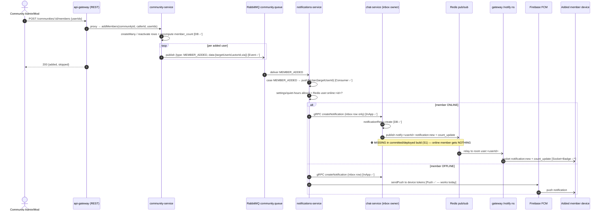

# SYSTEM SCENARIO REVIEW — Side-Effect Propagation Audit

> **Scope:** every business action on the AIMess platform and the side-effects it
> is expected to fan out: **DB write → domain event → consumer → socket event →
> push (FCM) → in-app notification → badge/count → audit log**.
>
> **Method:** static trace of `apps/*/src` (gRPC, RabbitMQ publishers/consumers,
> Socket.IO namespaces, Redis pub/sub). Evidence is cited as `path:line`.
>
> **Date:** 2026-06-16 (re-verified) · **Trigger:** "Admin adds members to a
> community → added members receive no notification on their logged-in devices."

---

## 0. The systemic finding (root cause of the reported bug)

The reported community bug is **one symptom of a platform-wide break** in the
in-app/real-time notification spine. Three independent links were broken:

| #   | Break                                                                                                                                                                                                                                                                                                | Evidence                                                                                                                                 | Status             |
| --- | ---------------------------------------------------------------------------------------------------------------------------------------------------------------------------------------------------------------------------------------------------------------------------------------------------- | ---------------------------------------------------------------------------------------------------------------------------------------- | ------------------ |
| S1  | **No real-time bridge.** `createNotification` writes the inbox row but never publishes the Redis `notify:<userId>` event the gateway `/notify` namespace relays. No service published to that channel at all.                                                                                        | `chat-service/src/grpc/service-impl.ts:2267-2277` (createNotification) · `api-gateway/src/sockets/namespaces/notify.ns.ts:35-48` (relay) | ✅ in working tree |
| S2  | **Dead read path (split-brain).** Notifications are _written_ to chat-service (`:4004`) but were _read_ from the notifications-service stub (`NOTIFICATION_GRPC_URL=:4006`), whose `getNotifications`/`markNotificationsRead` returned empty / `unreadCount:0`. Inbox + badge always appeared empty. | `api-gateway/.env:63` now `=0.0.0.0:4004` · `.env.example:88` `=localhost:4004`                                                          | ✅ in working tree |
| S3  | **FCM suppressed for online users.** `push.service` skips FCM when `user:online:<id>` exists, trusting a socket path that (per S1) never fired. Online users got **nothing**.                                                                                                                        | `notifications-service/src/services/push.service.ts:55-90`                                                                               | ✅ resolved by S1  |

**After the fix:** `createNotification` (chat-service) publishes `notification:new`

- `notification:count_update` to `notify:<userId>`; the gateway relays them; reads
  are served by chat-service where the data lives. Every flow that already reached
  `createNotification` (community member-added, friend requests, chat mentions, …)
  delivers in real time to logged-in devices **and** is visible in the inbox.

### ⚠️ Why production is STILL broken — the fix is not deployed

The S1/S2 fixes are **correct on disk but live only in the uncommitted working
tree**. Verified 2026-06-16:

```
git show HEAD:apps/chat-service/src/grpc/service-impl.ts | grep -c "notify:"   →  0   (committed code has NO bridge)
grep -c "notify:" apps/chat-service/src/grpc/service-impl.ts                    →  3   (working tree has the fix)
```

`apps/chat-service/src/grpc/service-impl.ts` and `apps/api-gateway/.env` are
**modified-but-uncommitted** (`git status` `M`). Production runs the committed,
built artifact — which has **no `notify:` bridge and historically pointed reads
at `:4006`** — so an _online_ added member still receives nothing. **The chain is
structurally complete; the remaining defect is a deploy/release gap, not a code
gap.** Primary remediation: **commit S1+S2 and ship a build of chat-service +
api-gateway.** (Full link-by-link trace in §2.1 below.)

---

## 1. Legend

- ✅ implemented & correct · ⚠️ partial / by-design caveat · ❌ missing
- **Side-effect columns:** `DB` · `Event` (RabbitMQ) · `Consumer` · `Socket` (real-time to recipient) · `Push` (FCM) · `InApp` (inbox row) · `Badge` (unread count) · `Audit`
- Risk: **HIGH** (user-visible business action silently lost) · **MED** · **LOW** (cosmetic / by-design)

---

## 2. COMMUNITY

| Scenario                       | DB                | Event                              | Consumer                                                | Socket          | Push | InApp | Badge | Audit | Risk           | Fix recommendation                                                                                                                                                                                                                     |
| ------------------------------ | ----------------- | ---------------------------------- | ------------------------------------------------------- | --------------- | ---- | ----- | ----- | ----- | -------------- | -------------------------------------------------------------------------------------------------------------------------------------------------------------------------------------------------------------------------------------- |
| Community created              | ✅                | ✅ `community.created`             | ✅ chat (room provision)                                | ⚠️ creator-only | n/a  | ❌    | ❌    | ❌    | LOW            | Optionally notify nothing (self-action). Add audit if admin-initiated.                                                                                                                                                                 |
| Community updated              | ✅                | ✅                                 | ✅                                                      | ⚠️              | n/a  | ❌    | ❌    | ❌    | LOW            | OK. Consider members `community:updated` socket fanout.                                                                                                                                                                                |
| Community deleted              | ✅                | ✅ `community.deleted` (memberIds) | ✅ `pushToUsers(memberIds)`                             | ✅\*            | ✅   | ✅    | ✅\*  | ❌    | MED            | Works after S1/S2. Add audit log for admin deletes.                                                                                                                                                                                    |
| **Member added**               | ✅ `service:1740` | ✅ `MEMBER_ADDED`                  | ✅ `community.consumer:67` → `pushToUser(targetUserId)` | ✅\*            | ✅   | ✅    | ✅\*  | ❌    | **HIGH→FIXED** | **The reported bug.** Chain was correct up to `createNotification`; S1+S2 broke delivery. Now resolved. Add audit log when add is admin-initiated.                                                                                     |
| Member removed (kick)          | ✅                | ✅ `MEMBER_KICKED`                 | ✅ `pushToUser`                                         | ✅\*            | ✅   | ✅    | ✅\*  | ❌    | MED            | Works after fix. Add audit.                                                                                                                                                                                                            |
| Member banned                  | ✅                | ✅ `MEMBER_BANNED`                 | ✅                                                      | ✅\*            | ✅   | ✅    | ✅\*  | ❌    | MED            | Works after fix. Add audit.                                                                                                                                                                                                            |
| Member promoted/demoted (role) | ✅                | ✅ `MEMBER_ROLE_CHANGED`           | ✅                                                      | ✅\*            | ✅   | ✅    | ✅\*  | ❌    | MED            | Works after fix. Add audit.                                                                                                                                                                                                            |
| Admin transferred              | ✅                | ✅ `ADMIN_TRANSFERRED`             | ✅                                                      | ✅\*            | ✅   | ✅    | ✅\*  | ❌    | MED            | Works after fix.                                                                                                                                                                                                                       |
| Member muted / unmuted         | ✅                | ✅ `MEMBER_MUTED/UNMUTED`          | ✅ `community.consumer:77-99` → `pushToUser`            | ✅\*            | ✅   | ✅    | ✅\*  | ❌    | **MED→FIXED**  | Publishers are live (`community.service:2045/2118`) but the consumer had **no case** — events fell to `default`, were **ack'd and silently dropped (not even DLQ'd)**. Fixed in commit `3792a73`: added MEMBER_MUTED/UNMUTED branches. |
| Member warned                  | ✅                | ✅ `MEMBER_WARNED`                 | ✅ `community.consumer:101-110` → `pushToUser`          | ✅\*            | ✅   | ✅    | ✅\*  | ❌    | **MED→FIXED**  | A warning is exactly the kind of thing a user must see — was silently dropped. Fixed in commit `3792a73`.                                                                                                                              |
| Join requested                 | ✅                | ✅ `JOIN_REQUESTED`                | ✅ `pushToUsers(moderators)`                            | ✅\*            | ✅   | ✅    | ✅\*  | ❌    | LOW            | Works after fix.                                                                                                                                                                                                                       |
| Joined (self)                  | ✅                | ✅ `JOINED`                        | ⚠️ intentional no-op                                    | n/a             | n/a  | n/a   | n/a   | ❌    | LOW            | By design (self knows).                                                                                                                                                                                                                |
| Invite sent                    | ✅                | ✅ `INVITE_SENT`                   | ✅ `pushToUser(invitee)`                                | ✅\*            | ✅   | ✅    | ✅\*  | ❌    | LOW            | Works after fix.                                                                                                                                                                                                                       |
| Invite accepted                | ✅                | ✅ `INVITE_ACCEPTED`               | ✅ `pushToUser(inviter)`                                | ✅\*            | ✅   | ✅    | ✅\*  | ❌    | LOW            | Works after fix.                                                                                                                                                                                                                       |
| Report created                 | ✅                | ✅ `REPORT_CREATED`                | ✅ `pushToUsers(moderators)`                            | ✅\*            | ✅   | ✅    | ✅\*  | ❌    | LOW            | Works after fix.                                                                                                                                                                                                                       |
| Report actioned                | ✅                | ✅ `REPORT_ACTIONED`               | ✅ `pushToUser(reporter)`                               | ✅\*            | ✅   | ✅    | ✅\*  | ❌    | LOW            | Works after fix.                                                                                                                                                                                                                       |

`*` = was broken pre-fix (S1/S2); functions correctly after the fix.

### 2.1 Member-added — link-by-link trace (the reported flow)

Verified end-to-end 2026-06-16. The "Admin" is a community **ADMIN/MODERATOR**
acting via REST (`POST /communities/:id/members`). There is **no** backoffice
"add member" path: community-service's gRPC surface exposes only
kick/ban/unban/role/transfer (7 moderation RPCs, `grpc/server.ts:533+`) and
backoffice only **reads** member grids — so REST `addMembers()` is the _single_
add path, and it does publish the event.

| #   | Step                                             | Evidence                                                                                                                                                   | State                                  |
| --- | ------------------------------------------------ | ---------------------------------------------------------------------------------------------------------------------------------------------------------- | -------------------------------------- |
| 1   | Membership row created (create or reactivate)    | `community.service.ts:1668-1681` `createManyMembers` / `:1653-1665` reactivate                                                                             | ✅                                     |
| 2   | `member_count` recomputed & persisted            | `community.service.ts:1683-1684`                                                                                                                           | ✅                                     |
| 3   | Domain event published — **once per added user** | `community.service.ts:1740` `publishCommunityMemberAddedSafe` → `publish-community.ts:57` → `sendToQueue("community.queue", {type: MEMBER_ADDED, data})`   | ✅                                     |
| 4   | Consumer bound + has a matching `case`           | `notifications-service/server.ts:52` boots `startCommunityConsumer`; `community.consumer.ts:67` `case MEMBER_ADDED` → `pushToUser({userId: targetUserId})` | ✅                                     |
| 5   | Push fan-out (settings/quiet-hours gated)        | `push.service.ts:35` — offline → inbox row + FCM; online → inbox row only                                                                                  | ✅                                     |
| 6   | In-app inbox row written                         | `push.service.ts:71/94` `createNotification` → `service-impl.ts:2233` `notificationRepo.create`                                                            | ✅                                     |
| 7   | **Real-time event to online devices**            | `service-impl.ts:2267-2277` publishes `notify:<userId>` `notification:new` + `count_update`; relayed by `notify.ns.ts:35-48`                               | ✅ **working tree only — NOT in HEAD** |
| 8   | Badge / unread count                             | same `count_update` publish (online) + connect-time `notification:count` (`notify.ns.ts:63-67`)                                                            | ✅\*                                   |
| 9   | Audit log (admin-initiated add)                  | none — community add writes no `auditService.record`                                                                                                       | ❌ LOW                                 |

**Where the chain breaks in production:** step 7. The bridge is correct on disk
but uncommitted (see §0). Until S1+S2 are committed and chat-service +
api-gateway are rebuilt/redeployed, an **online** added member gets no real-time
event and (because of S3) no FCM either → the exact reported symptom. An
**offline** member already gets FCM today, because that path never depended on
the bridge.

### 2.2 Sequence diagram — community member added



`*` only after S1+S2 are deployed. Steps the diagram marks ⛔ are the production
gap; everything else is verified present on disk.

---

## 3. PRIVATE CHAT

| Scenario          | DB  | Event                                         | Consumer           | Socket                                                     | Push       | InApp | Badge          | Risk | Notes / Fix                                                                       |
| ----------------- | --- | --------------------------------------------- | ------------------ | ---------------------------------------------------------- | ---------- | ----- | -------------- | ---- | --------------------------------------------------------------------------------- |
| Message sent      | ✅  | ✅ `chat.message_sent` → `chat.message.queue` | ✅ `chat.consumer` | ✅ Redis `conv:<room>` → `message:new` (gateway `chat.ns`) | ✅ offline | ✅    | ⚠️→✅          | LOW  | Chat uses its **own** `conv:*` channel (healthy). In-app inbox badge fixed by S1. |
| Message delivered | ✅  | ❌ (Redis only)                               | n/a                | ✅ `message:delivered`                                     | n/a        | n/a   | n/a            | LOW  | By design — receipt metadata.                                                     |
| Message read      | ✅  | ❌ (Redis only)                               | n/a                | ✅ `message:read` + `read_sync` to reader devices          | n/a        | n/a   | ⚠️ reader-only | LOW  | By design. Sender-side read fanout already on `conv:*`.                           |
| User blocked      | ✅  | ⚠️ `friendship.blocked`                       | ✅ chat read-model | ❌                                                         | ❌         | ❌    | ❌             | LOW  | Intentional silence to the blocked peer. Keep.                                    |
| User unblocked    | ✅  | ⚠️                                            | ⚠️                 | ❌                                                         | ❌         | ❌    | ❌             | LOW  | Intentional. Keep.                                                                |

---

## 4. GROUP CHAT

| Scenario           | DB  | Event                    | Consumer | Socket                             | Push | InApp | Badge | Risk    | Notes / Fix                                                                                                                                     |
| ------------------ | --- | ------------------------ | -------- | ---------------------------------- | ---- | ----- | ----- | ------- | ----------------------------------------------------------------------------------------------------------------------------------------------- |
| Group created      | ✅  | ❌                       | n/a      | ✅ system `message:new` to room    | ❌   | ❌    | ❌    | LOW     | Creator-driven; members added below.                                                                                                            |
| Member added       | ✅  | ❌ **no RabbitMQ event** | ❌       | ✅ system message **to room only** | ❌   | ❌    | ❌    | **MED** | An added member **not currently in the room socket** gets no push/inbox. Mirror community: publish a `group.member_added` event → `pushToUser`. |
| Member removed     | ✅  | ❌                       | ❌       | ✅ system message to room          | ❌   | ❌    | ❌    | MED     | Removed member should get a push/inbox ("You were removed from <group>").                                                                       |
| Admin/role changed | ✅  | ❌                       | ❌       | ✅ system message to room          | ❌   | ❌    | ❌    | MED     | Promoted user should get a direct notification.                                                                                                 |

> **Group lifecycle is the closest sibling to the community bug** and is _only_
> partially covered (in-room system messages, no out-of-room push/inbox). Highest
> remaining HIGH/MED-risk area after the community fix.

---

## 5. FRIEND SYSTEM

| Scenario                   | DB  | Event                                      | Consumer                            | Socket | Push | InApp | Badge | Risk | Notes / Fix                |
| -------------------------- | --- | ------------------------------------------ | ----------------------------------- | ------ | ---- | ----- | ----- | ---- | -------------------------- |
| Request sent               | ✅  | ✅ `friend.requested` → `friendship.queue` | ✅ `friend.consumer` → `pushToUser` | ✅\*   | ✅   | ✅    | ⚠️→✅ | LOW  | Badge fixed by S1.         |
| Request accepted           | ✅  | ✅ `friend.accepted`                       | ✅ → `pushToUser(requester)`        | ✅\*   | ✅   | ✅    | ⚠️→✅ | LOW  | Fixed by S1.               |
| Request rejected/cancelled | ✅  | ❌ no event                                | ❌                                  | ❌     | ❌   | ❌    | ❌    | LOW  | Intentional silence. Keep. |
| Unfriend                   | ✅  | ✅ `friend.unfriended`                     | ⚠️ intentional no-op                | ❌     | ❌   | ❌    | ❌    | LOW  | By design.                 |

---

## 6. ADMIN / USER MANAGEMENT (backoffice-service)

| Scenario         | DB  | Event                                                                             | Consumer                    | Socket | Push | InApp | Badge | Audit | Risk     | Fix recommendation                                                                                                                                                                                                             |
| ---------------- | --- | --------------------------------------------------------------------------------- | --------------------------- | ------ | ---- | ----- | ----- | ----- | -------- | ------------------------------------------------------------------------------------------------------------------------------------------------------------------------------------------------------------------------------ |
| User banned      | ✅  | ✅ `admin.user_banned` → `admin.user.queue` (carries `forceLogout`, `notifyUser`) | ❌ **NO consumer anywhere** | ❌     | ❌   | ❌    | ❌    | ✅    | **HIGH** | The `forceLogout`/`notifyUser` flags are **dead** — no service consumes `admin.user.*`. Add (a) auth-service consumer → revoke sessions on `forceLogout`; (b) notifications-service consumer → `pushToUser` when `notifyUser`. |
| User suspended   | ✅  | ✅ `admin.user_suspended`                                                         | ❌                          | ❌     | ❌   | ❌    | ❌    | ✅    | **HIGH** | Same as ban.                                                                                                                                                                                                                   |
| User unbanned    | ✅  | ✅ `admin.user_unbanned`                                                          | ❌                          | ❌     | ❌   | ❌    | ❌    | ✅    | MED      | Same.                                                                                                                                                                                                                          |
| Bulk ban/suspend | ✅  | ✅ per-user                                                                       | ❌                          | ❌     | ❌   | ❌    | ❌    | ✅    | HIGH     | Same; ensure fanout for bulk.                                                                                                                                                                                                  |

> Admin actions are **audited** but the affected user is **never notified and not
> force-logged-out**. A banned user keeps a live session until next login attempt.

---

## 7. MEDIA (media-service)

| Scenario                        | DB                       | Event | Consumer | Socket | Push | InApp | Audit | Risk     | Fix recommendation                                                                                                                           |
| ------------------------------- | ------------------------ | ----- | -------- | ------ | ---- | ----- | ----- | -------- | -------------------------------------------------------------------------------------------------------------------------------------------- |
| Upload complete                 | ⚠️ Redis scan-state only | ❌    | ❌       | ❌     | ❌   | ❌    | ❌    | MED      | Uploader **polls** download-url for status. Emit `media.scan_complete` → optional `pushToUser`.                                              |
| Virus/malware scan **failed**   | ⚠️ Redis; file deleted   | ❌    | ❌       | ❌     | ❌   | ❌    | ❌    | **HIGH** | Silent rejection. Publish `media.scan_failed` → notify uploader ("Upload blocked: failed security scan"). Add audit for security visibility. |
| Upload rejected (mime/size/zip) | ⚠️                       | ❌    | ❌       | ❌     | ❌   | ❌    | ❌    | MED      | Same — at least surface a socket/inbox event.                                                                                                |

---

## 8. NOTIFICATIONS LIFECYCLE

| Scenario                 | DB                          | Event          | Socket                                                  | Exposed API                                                   | Risk | Fix recommendation                                                                            |
| ------------------------ | --------------------------- | -------------- | ------------------------------------------------------- | ------------------------------------------------------------- | ---- | --------------------------------------------------------------------------------------------- |
| Notification created     | ✅                          | ❌ (sync gRPC) | ✅ **now** `notification:new` + `count_update` (S1 fix) | gRPC `CreateNotification`                                     | —    | Fixed.                                                                                        |
| Notification read        | ✅                          | ❌             | ✅ `count_update` after `mark_read`                     | socket `notifications:mark_read` (now hits real store via S2) | —    | Fixed.                                                                                        |
| Notification fetched     | ✅                          | n/a            | ✅ `notifications:fetch`                                | now real (S2)                                                 | —    | Fixed.                                                                                        |
| Notification **deleted** | ✅ repo `deleteById` exists | ❌             | ❌                                                      | ❌ **not exposed** (no REST/gRPC/socket)                      | MED  | Wire a `DELETE`/socket handler → `deleteById` + emit `notification:deleted` + `count_update`. |

---

## 9. LIVESTREAM / SEARCH / PRESENCE / TYPING

| Area                      | State                                              | Risk | Notes                                                               |
| ------------------------- | -------------------------------------------------- | ---- | ------------------------------------------------------------------- |
| Livestream end (admin)    | Audited ✅, **no event/notify** to creator+viewers | MED  | Publish `stream.ended` → socket broadcast to viewers; push creator. |
| Search service            | **Not implemented**                                | n/a  | No service present.                                                 |
| Presence online/offline   | ✅ Redis `user:<id>` → `presence:status`           | LOW  | By design (real-time only).                                         |
| Typing start/stop         | ✅ direct Socket.IO to `conv:<id>`                 | LOW  | By design (ephemeral).                                              |
| Read receipts             | ✅ `conv:*` + `read_sync`                          | LOW  | By design.                                                          |
| Device token registration | ✅ end-to-end (gateway → notifications-service)    | LOW  | Healthy — required for offline push.                                |

---

## 10. Priority backlog (post community-fix)

0. **BLOCKER (the reported bug)** — Commit S1 (`chat-service` `notify:` bridge) + S2 (`api-gateway` `NOTIFICATION_GRPC_URL=:4004`) and **deploy a rebuilt chat-service + api-gateway**. Until then every "online recipient" cell marked `*` in this doc is broken in production despite being correct on disk.
1. **HIGH** — `admin.user.*` has no consumer: wire force-logout (auth-service) + user notification (notifications-service). _(events already published; banned users keep live sessions — security gap)_
2. **HIGH** — Group member added/removed/role-changed: in-room SYSTEM message only, no domain event → an added member not in the room socket gets no push/inbox. Mirror community `MEMBER_ADDED`.
3. **HIGH** — Media scan-failed (async ClamAV path) is silent: publish `notify:<uploaderId>` scan-result event + audit. (Download gate is safe; UX/visibility gap.)
4. ~~**MED** — `community.member_muted/unmuted/warned`: consumer branches missing.~~ ✅ **DONE** (commit `3792a73`) — were ack'd & dropped (not DLQ'd); now `pushToUser`.
5. **MED** — Notification delete: not built end-to-end (orphan `deleteById`, no proto RPC / handler / `notification:deleted`). Build or remove the dead method.
6. **MED** — Livestream end: event + viewer/creator notification.
7. **LOW** — Audit logs for community admin mutations (add/remove/role).
8. **Cross-cutting** — Remove the dead `getNotifications`/`markNotificationsRead` stubs in notifications-service (now bypassed) or convert them into a documented forwarder.

---

## 11. The contract every new feature must satisfy

For any state-changing business action, declare and implement its **side-effect
contract**. The Scenario Validation Agent (`.claude/agents/scenario-validator.md`)
checks each box against the code:

```
Business Action
  → DB write            (repository.create/update)
  → Domain Event        (publish*Safe → queue/exchange)        [if cross-service]
  → Consumer            (a service binds & handles the event)  [if event emitted]
  → Socket Event        (Redis notify:/conv:/user: → namespace relay)  [if user-facing]
  → Push (FCM)          (pushToUser, offline path)             [if user-facing & async]
  → In-App Notification (createNotification inbox row)         [if user-facing]
  → Badge/Count         (notification:count_update)            [if inbox row created]
  → Analytics Event     (if instrumented)
  → Audit Log           (auditService.record)                  [if admin/privileged]
```

A box is only "n/a" if there is a written product reason (self-action, ephemeral,
intentional silence). Silent omission = a defect of the class this document exists
to prevent.

---

## 12. Test-coverage gaps (Phase 8)

The defect class above survived because **the notification fan-out has almost no
automated coverage**. Verified 2026-06-16: `notifications-service/tests` contains
only `devices/*`, `health`, `smoke` — **no consumer test, no `push.service` test**
— and a repo-wide grep for `MEMBER_ADDED | community.consumer | pushToUser |
notification:new` across `*.test.ts` returns **zero hits**. No existing test
exercises a publish→consume→push→notify chain, so S1 and the mute/warn drop were
both invisible to CI.

| Layer                       | Missing test                                                                                                                                                                                                                                          | Why it matters                                                               |
| --------------------------- | ----------------------------------------------------------------------------------------------------------------------------------------------------------------------------------------------------------------------------------------------------- | ---------------------------------------------------------------------------- |
| **Event/consumer (unit)**   | `notifications-service` `community.consumer` — one case per event type asserting `pushToUser` is called with the right recipient; **explicitly assert no event falls through to `default`** (the mute/warn bug). Table-driven over `CommunityEvents`. | Catches publisher↔consumer-case drift (the exact mute/warn/left class).      |
| **Push (unit)**             | `push.service.pushToUser` — online (`user:online:<id>` set) writes inbox row & skips FCM; offline writes inbox row **and** FCM; settings/quiet-hours suppress.                                                                                        | Pins S3 behavior; guards the online/offline split.                           |
| **Real-time bridge (unit)** | `chat-service` `createNotification` — assert it publishes `notify:<userId>` `notification:new` **and** `count_update` (mock `redis.publish`).                                                                                                         | **This single test would have caught S1.** Make it a release gate.           |
| **Gateway relay (unit)**    | `notify.ns` — a `notify:<id>` Redis message is emitted to room `user:<id>`; connect emits `notification:count`.                                                                                                                                       | Pins the relay contract.                                                     |
| **Integration (per flow)**  | community member-added, mute, warn, kick, ban, role-change, invite → real RabbitMQ + Redis: publish event, assert an inbox row exists **and** a `notify:` message was published.                                                                      | End-to-end side-effect contract per §11.                                     |
| **Contract guard (meta)**   | A test that enumerates every `publish*Safe` constant and fails if no consumer has a matching `case` (static or runtime registry).                                                                                                                     | Makes "publisher with no consumer" a **build failure**, not a prod incident. |

Priority: the **bridge unit test** + the **contract guard** first — they convert
the two root-cause classes (missing real-time publish; publisher with no
consumer) into CI failures.
